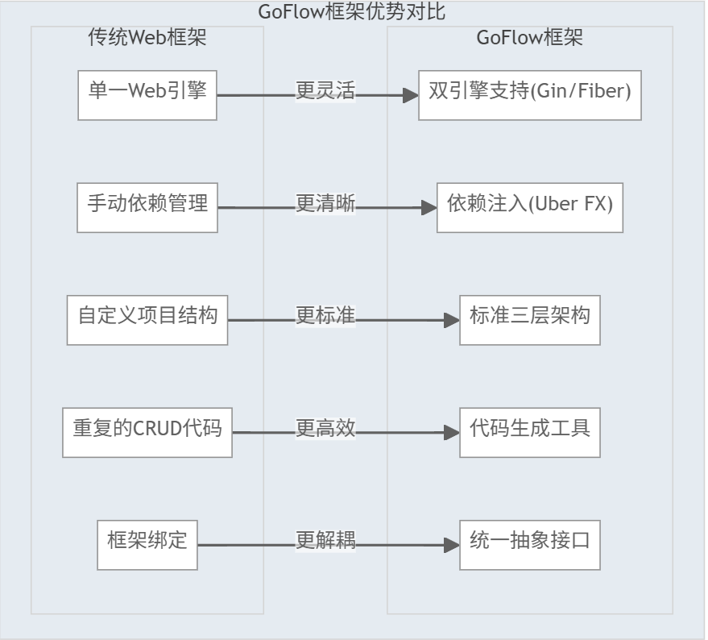
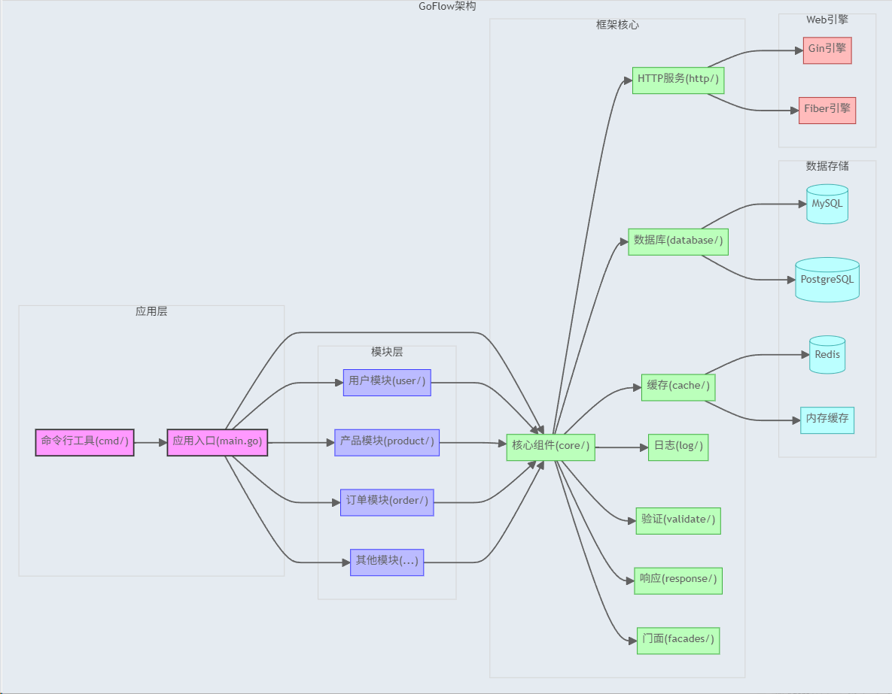
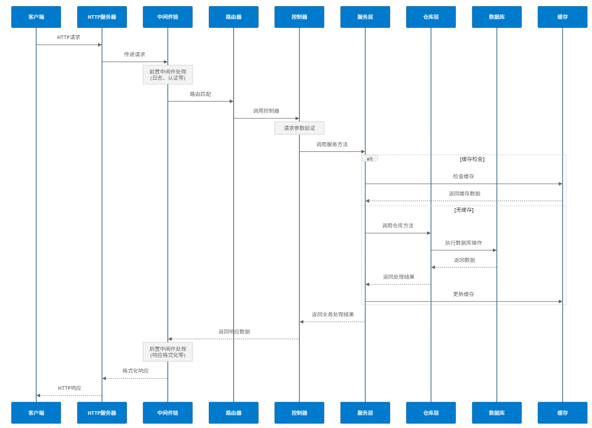
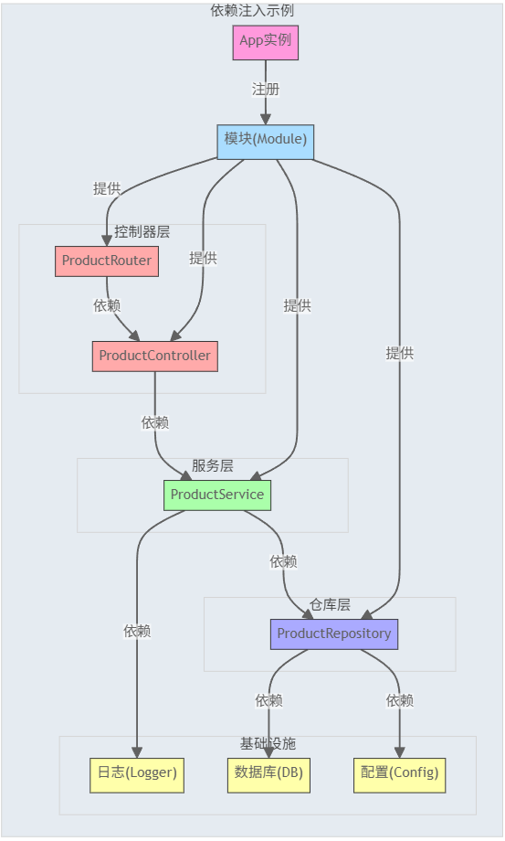

# GoFlow 框架

## 框架概述

GoFlow 是一个基于 Go 语言开发的高性能、模块化、易扩展的服务端框架，专注于提供简洁而强大的企业级应用开发体验。框架采用 Uber Fx 实现依赖注入和模块化管理，同时支持 Gin 和 Fiber 两种高性能 Web 框架，为开发者提供了统一的抽象接口和一致的开发体验。

### 架构总览

下图展示了GoFlow框架的整体架构设计和各组件之间的关系：



从上图可以看出，GoFlow框架采用了清晰的分层设计：
- **应用层**：包含应用入口和命令行工具
- **模块层**：包含各个业务功能模块
- **框架核心**：提供核心功能和抽象接口
- **Web引擎**：支持Gin和Fiber两种高性能Web框架
- **数据存储**：支持多种数据库和缓存系统

### 设计理念

GoFlow 框架的设计理念基于以下核心原则：

1. **模块化优先**：应用被组织为独立的功能模块，每个模块包含完整的MVC结构，可以单独开发、测试和部署。
2. **约定优于配置**：提供合理的默认设置和标准化的项目结构，减少配置负担。
3. **依赖注入**：通过依赖注入实现组件间的低耦合，提高代码可测试性和可维护性。
4. **统一抽象**：屏蔽底层Web框架差异，提供统一的开发接口。
5. **开发效率**：内置代码生成工具，快速生成标准CRUD代码，提升开发效率。

### 核心技术栈

GoFlow 框架基于一系列精心选择的现代 Go 技术栈构建：

- **依赖注入**：Uber Fx
- **Web框架**：Gin / Fiber (可切换)
- **ORM框架**：GORM
- **配置管理**：Viper
- **日志系统**：Logrus
- **缓存支持**：Redis / 内存缓存
- **参数验证**：validator
- **命令行工具**：Cobra

### 适用场景

GoFlow 框架适合以下应用场景：

- **微服务开发**：
  - 支持轻量级微服务架构，模块化设计便于拆分和组合服务
  - 每个模块可独立部署为微服务，共享核心库
  - 内置配置中心和服务发现集成能力
  - 支持分布式链路追踪和日志聚合

- **RESTful API**：
  - 内置完整的REST API支持，包括参数验证、统一响应格式等
  - 自动生成符合REST规范的CRUD接口
  - 支持API版本管理和路由分组
  - 内置跨域处理和API文档生成

- **企业级应用**：
  - 提供完整的项目架构和最佳实践，适合构建复杂企业应用
  - 支持复杂的权限控制和用户管理
  - 内置审计日志和操作记录
  - 事务管理和数据一致性保障

- **高性能服务**：
  - 基于高性能的Gin/Fiber框架，适合构建高并发服务
  - 连接池优化，减少资源消耗
  - 缓存策略降低数据库压力
  - 异步处理支持提升吞吐量

- **快速原型开发**：
  - 通过代码生成工具快速搭建应用原型
  - 几分钟内生成完整CRUD功能
  - 标准化的代码结构，易于扩展
  - 内置常用业务模板

### 框架优势

与其他Go框架相比，GoFlow具有以下显著优势：

1. **双引擎支持**：同时支持Gin和Fiber两种高性能Web框架，开发者可根据需求灵活选择
2. **统一抽象层**：提供统一的HTTP上下文、路由接口和中间件系统
3. **完整项目结构**：预定义清晰的项目结构，包括控制器、服务、仓库等标准化组件
4. **强大的代码生成**：通过简单命令生成符合框架规范的代码，避免重复劳动
5. **门面模式**：提供全局服务访问点，简化代码编写
6. **可测试性**：依赖注入设计便于编写单元测试和集成测试
7. **开箱即用**：内置常用功能，如参数验证、错误处理、日志记录等

GoFlow 框架既适合初学者快速上手，也满足专业开发者对于架构和性能的高要求，是构建现代Go应用的理想选择。

## 目录

- [框架特性](#框架特性)
- [项目结构](#项目结构)
- [快速开始](#快速开始)
- [框架核心](#框架核心)
  - [应用启动流程](#应用启动流程)
  - [模块化设计](#模块化设计)
  - [依赖注入](#依赖注入)
- [路由与控制器](#路由与控制器)
  - [路由注册](#路由注册)
  - [路由前缀](#路由前缀)
  - [控制器示例](#控制器示例)
- [服务层](#服务层)
  - [服务定义](#服务定义)
  - [服务实现](#服务实现)
- [数据访问层](#数据访问层)
  - [仓库模式](#仓库模式)
  - [GORM集成](#gorm集成)
  - [数据查询](#数据查询)
- [参数验证](#参数验证)
  - [自定义验证规则](#自定义验证规则)
  - [中文错误提示](#中文错误提示)
  - [验证示例](#验证示例)
- [响应处理](#响应处理)
  - [统一响应格式](#统一响应格式)
  - [错误处理](#错误处理)
  - [分页响应](#分页响应)
- [命令行工具](#命令行工具)
  - [生成应用模块](#生成应用模块)
  - [生成模型和仓库](#生成模型和仓库)
  - [生成服务和控制器](#生成服务和控制器)
  - [清理模块文件](#清理模块文件)
- [最佳实践](#最佳实践)
  - [项目组织](#项目组织)
  - [API设计](#api设计)
  - [错误处理](#错误处理-1)
- [常见问题](#常见问题)

## 框架特性

GoFlow 框架提供了丰富的特性，为Go应用开发提供全面支持：

### 核心架构

1. **统一Web引擎抽象**
   - 同时支持 Gin 和 Fiber 两种高性能Web框架
   - 通过统一接口层(unified)抽象路由、上下文和中间件
   - 零修改代码即可在框架间切换，兼顾性能与灵活性
   - 路由器适配器设计，轻松扩展支持更多Web框架

2. **依赖注入系统**
   - 基于 Uber FX 的依赖注入容器
   - 自动解析和注入组件依赖，避免手动创建实例
   - 通过注解(fx.Annotate)提供更精细的依赖控制
   - 组参数(fx.In)和组结果(fx.Out)支持，优雅处理多实例依赖
   - 生命周期钩子，支持优雅启动和关闭

3. **模块化应用设计**
   - 独立模块定义，支持多应用组合
   - 每个模块拥有独立的路由前缀和依赖项
   - 支持按需加载模块，灵活组织应用结构
   - 模块间隔离，降低代码耦合
   - 支持模块内自定义配置和中间件

### 应用架构

1. **三层架构实现**
   - **控制器层(Controller)**: 处理HTTP请求和响应
   - **服务层(Service)**: 实现核心业务逻辑
   - **仓库层(Repository)**: 负责数据访问和持久化
   - 清晰的职责分离，提高代码可维护性
   - 每层提供标准接口和实现模板

2. **请求生命周期管理**
   - 中间件链处理请求前置和后置逻辑
   - 统一的参数解析和验证流程
   - 标准化的错误处理和响应格式
   - 请求上下文传递，支持请求追踪和监控
   
   下图展示了一个HTTP请求在GoFlow框架中的完整生命周期：
   

### 数据访问

1. **GORM集成**
   - 支持MySQL、PostgreSQL、SQLite等多种数据库
   - 自动模型迁移，简化数据库schema管理
   - 事务支持，包括嵌套事务和事务中间件
   - 预加载、关联查询等高级功能支持
   - 软删除、乐观锁等企业级特性

2. **仓库模式封装**
   - 标准化CRUD操作，减少重复代码
   - 查询构建器，支持复杂查询条件组合
   - 分页查询内置支持，自动处理偏移和限制
   - 多条件动态查询，适应复杂业务场景
   - 数据映射和转换，隔离数据层和业务层

### 中间件与功能

1. **参数验证**
   - 基于validator的强大验证规则
   - 支持多种请求数据源验证(JSON、Query、Form等)
   - 自定义验证规则扩展
   - 中文错误提示，提升用户体验
   - 链式验证，支持嵌套结构验证

2. **响应处理**
   - 统一的响应格式和状态码定义
   - 成功响应和错误响应的标准化处理
   - 支持分页数据响应格式
   - JSON序列化定制，控制字段输出
   - 不同类型(JSON、XML、文件等)响应支持

3. **日志系统**
   - 基于Logrus的结构化日志
   - 多级别日志控制(Debug、Info、Warn、Error等)
   - 可配置的日志输出格式(Text、JSON)
   - 支持文件、控制台等多种输出目标
   - 字段化日志，支持上下文信息记录

4. **缓存支持**
   - Redis和内存缓存多种驱动选择
   - 统一的缓存接口抽象
   - 支持对象自动序列化和反序列化
   - 缓存标签系统，便于分组管理
   - 多种缓存策略(直写、回写、惰性加载)

### 开发工具与支持

1. **代码生成CLI**
   - 基于Cobra构建的命令行工具
   - 一键生成模块、控制器、服务、仓库等代码
   - 模板驱动，支持自定义代码生成模板
   - 支持批量生成和单文件生成
   - 自动处理依赖关系和文件引用

2. **配置管理**
   - 基于Viper的灵活配置系统
   - YAML格式配置文件支持
   - 环境变量覆盖配置
   - 多环境配置(开发、测试、生产)
   - 运行时配置热更新支持

3. **开发体验**
   - 热重载支持，提升开发效率
   - 详细的错误提示和调试信息
   - 自动API文档生成
   - 内置性能分析工具
   - 开发模式与生产模式区分

### 性能与可靠性

1. **高性能设计**
   - 底层基于高性能Web框架(Gin/Fiber)
   - 连接池优化(数据库、Redis等)
   - 缓存策略减少重复计算
   - 异步处理支持，提高吞吐量
   - 内存使用优化，减少GC压力

2. **可靠性保障**
   - 全面的错误处理机制
   - 优雅启动和关闭流程
   - 健康检查和就绪探针
   - 超时控制和熔断机制
   - 自动恢复和故障转移

## 项目结构

GoFlow 框架采用清晰的目录结构，遵循 Go 项目标准布局和领域驱动设计理念，便于模块化开发和代码组织：

### 项目整体结构

```
go-flow/
├── cmd/                   # 命令行工具入口
├── config/                # 配置文件目录
├── internal/              # 应用内部模块
├── main.go                # 应用主入口
├── pkg/                   # 框架核心包
└── util/                  # 通用工具函数
```

### 核心目录详解

#### cmd/ - 命令行工具

命令行工具目录包含框架提供的代码生成和管理功能：

```
cmd/
├── cli.go                 # CLI 工具主入口
├── gen.go                 # 代码生成命令实现
└── zdm.go                 # 命令管理器
```

- **cli.go**：命令行接口定义和管理
- **gen.go**：包含所有代码生成模板和生成逻辑
- **zdm.go**：命令注册和执行控制

#### config/ - 配置文件

配置文件目录包含应用的各种配置：

```
config/
├── config.yaml            # 主配置文件
├── dev/                   # 开发环境配置
├── test/                  # 测试环境配置
└── prod/                  # 生产环境配置
```

#### internal/ - 应用模块

应用内部模块目录，每个模块都是一个完整的功能单元：

```
internal/
├── demo/                  # 示例模块
│   ├── controller/        # 控制器层
│   │   ├── user_controller.go
│   │   └── user_router.go
│   ├── model/             # 数据模型
│   │   └── user.go
│   ├── module.go          # 模块定义
│   ├── repository/        # 数据访问层
│   │   └── user_repository.go
│   ├── schemas/           # 请求/响应模式
│   │   ├── req/
│   │   │   └── base.go
│   │   └── resp/
│   └── service/           # 服务层
│       └── user_service.go
├── shop/                  # 商店模块
├── test/                  # 测试模块
└── user/                  # 用户模块
```

每个模块包含以下标准组件：
- **controller/**：HTTP控制器和路由定义
- **model/**：数据库模型定义
- **repository/**：数据访问层实现
- **service/**：业务逻辑层实现
- **schemas/**：请求和响应结构定义
- **module.go**：模块配置和依赖注入

#### pkg/ - 框架核心包

框架核心包包含所有框架级别的功能实现：

```
pkg/
├── cache/                 # 缓存支持
│   ├── helper.go          # 缓存助手函数
│   ├── mock.go            # 缓存模拟实现(测试用)
│   ├── module.go          # 缓存模块定义
│   └── redis.go           # Redis缓存实现
├── config/                # 配置管理
│   └── config.go          # 配置加载和访问
├── core/                  # 核心组件
│   ├── app.go             # 应用管理
│   └── module.go          # 模块接口定义
├── database/              # 数据库支持
│   └── gorm.go            # GORM集成
├── facades/               # 服务门面
│   ├── cache.go           # 缓存门面
│   ├── config.go          # 配置门面
│   ├── db.go              # 数据库门面
│   ├── facades.go         # 门面管理
│   └── log.go             # 日志门面
├── http/                  # HTTP服务
│   ├── fiber.go           # Fiber框架支持
│   ├── gin.go             # Gin框架支持
│   ├── middleware/        # 中间件
│   │   ├── fiberlogrus.go # Fiber日志中间件
│   │   ├── ginlogrus.go   # Gin日志中间件
│   │   └── logger.go      # 通用日志中间件
│   ├── module.go          # HTTP模块定义
│   ├── server.go          # 服务器接口
│   └── unified/           # 统一抽象接口
│       ├── context.go     # 统一上下文接口
│       ├── fiber_context.go # Fiber上下文适配器
│       ├── gin_context.go # Gin上下文适配器
│       ├── middleware.go  # 统一中间件接口
│       └── router.go      # 统一路由接口
├── log/                   # 日志组件
│   └── logrus.go          # Logrus集成
├── response/              # 响应处理
│   ├── common.go          # 通用响应函数
│   ├── error.go           # 错误处理
│   ├── fiber.go           # Fiber响应适配
│   ├── response.go        # 响应定义
│   └── unified.go         # 统一响应接口
├── types/                 # 类型定义
│   ├── gorm.go            # GORM类型扩展
│   └── time.go            # 时间类型扩展
└── validate/              # 参数验证
    ├── custom.go          # 自定义验证器
    ├── example.go         # 验证器示例
    ├── module.go          # 验证模块定义
    ├── translator.go      # 错误消息翻译器
    └── unified.go         # 统一验证接口
```

#### util/ - 通用工具

通用工具函数目录，提供各种辅助功能：

```
util/
├── array.go               # 数组操作工具
├── convert.go             # 类型转换工具
├── FileUtil.go            # 文件操作工具
├── string.go              # 字符串操作工具
├── tools.go               # 杂项工具函数
└── verify.go              # 验证辅助工具
```

### 模块依赖结构

GoFlow框架的依赖注入结构：

```
App
  ├─ Config Module
  ├─ Log Module
  ├─ Database Module
  ├─ Cache Module
  ├─ HTTP Module
  │   ├─ Gin Engine (可选)
  │   └─ Fiber App (可选)
  ├─ Facades Module
  └─ Application Modules
      ├─ Module 1
      │   ├─ Repository Layer
      │   ├─ Service Layer
      │   └─ Controller Layer
      ├─ Module 2
      └─ Module 3
```

## 快速开始

### 环境准备

在开始使用 GoFlow 框架之前，请确保您的开发环境满足以下条件：

- Go 1.18 或更高版本 (建议使用最新的稳定版)
- MySQL 5.7+ / PostgreSQL 10+ (可选，取决于你的数据库选择)
- Redis 5.0+ (可选，如需使用缓存功能)
- Git (用于获取框架代码和依赖)

### 获取框架

#### 方法一：克隆项目

```bash
# 克隆仓库
git clone https://github.com/zhoudm1743/go-flow.git
cd go-flow

# 安装依赖
go mod tidy
```

#### 方法二：使用模板创建

```bash
# 使用模板创建新项目
git clone https://github.com/zhoudm1743/go-flow-template.git my-project
cd my-project

# 初始化项目
go mod tidy
```

### 运行示例应用

GoFlow 框架包含一个演示模块，可用于快速了解框架功能：

```bash
# 运行应用
go run main.go
```

默认情况下，应用将在 `http://localhost:8080` 启动。可访问以下链接测试示例API：

- 获取用户列表: `GET http://localhost:8080/demo/api/users/`
- 获取单个用户: `GET http://localhost:8080/demo/api/users/1`

### 项目配置

编辑 `config/config.yaml` 文件，根据需要调整配置：

```yaml
app:
  name: my-go-flow-app     # 应用名称
  version: 0.1.0           # 应用版本
  mode: dev                # 运行模式: dev, test, prod

http:
  host: 0.0.0.0            # 监听地址
  port: 8080               # 监听端口
  engine: gin              # Web框架选择: gin, fiber
  read_timeout: 10s        # 读取超时
  write_timeout: 10s       # 写入超时

database:
  driver: mysql            # 数据库类型: mysql, postgres, sqlite
  dsn: root:password@tcp(localhost:3306)/go_flow?charset=utf8mb4&parseTime=True&loc=Local
  max_open_conns: 100      # 最大连接数
  max_idle_conns: 10       # 最大空闲连接数
```

### 创建第一个应用模块

GoFlow 框架提供了强大的代码生成功能，可以快速创建标准化的模块和组件：

#### 1. 创建产品模块

```bash
# 生成产品模块 (参数: 模块名称 实体名称 中文描述)
go run main.go gen module product product 产品
```

这将创建一个完整的产品模块，包含控制器、服务、仓库、模型和路由定义，位于 `internal/product` 目录。

#### 2. 注册模块到应用

编辑 `main.go` 文件，添加新模块：

```go
package main

import (
    "os"
    
    "github.com/zhoudm1743/go-flow/cmd"
    "github.com/zhoudm1743/go-flow/internal/demo"
    "github.com/zhoudm1743/go-flow/internal/product" // 导入新模块
    "github.com/zhoudm1743/go-flow/pkg/core"
    "github.com/zhoudm1743/go-flow/pkg/http"
)

func main() {
    // 检查是否是命令行模式
    if len(os.Args) > 1 && os.Args[1] == "gen" {
        cmd.Execute()
        return
    }
    
    // 创建应用实例
    app := core.NewApp("go-flow")
    
    // 添加HTTP模块
    app.WithOptions(http.UnifiedModule)
    
    // 添加应用模块
    app.AddModule(demo.NewModule())
    app.AddModule(product.NewModule()) // 注册产品模块
    
    // 启动应用
    app.Run()
}
```

#### 3. 定义产品模型

编辑 `internal/product/model/product.go` 文件，定义产品模型：

```go
package model

import (
    "gorm.io/gorm"
)

// Product 产品模型
type Product struct {
    gorm.Model
    Name        string  `gorm:"size:100;not null"`
    Description string  `gorm:"type:text"`
    Price       float64 `gorm:"type:decimal(10,2);not null"`
    Stock       int     `gorm:"not null;default:0"`
}
```

#### 4. 创建数据库迁移

产品模型将在应用启动时自动迁移到数据库。

#### 5. 启动应用

```bash
go run main.go
```

#### 6. 访问API

现在你可以访问产品模块的API：

- 获取产品列表: `GET http://localhost:8080/product/api/products/`
- 创建产品: `POST http://localhost:8080/product/api/products/`
  ```json
  {
    "name": "示例产品",
    "description": "这是一个示例产品",
    "price": 99.99,
    "stock": 100
  }
  ```
- 获取单个产品: `GET http://localhost:8080/product/api/products/1`
- 更新产品: `PUT http://localhost:8080/product/api/products/1`
- 删除产品: `DELETE http://localhost:8080/product/api/products/1`

### 自定义控制器

如果你需要添加自定义业务逻辑，可以修改控制器。例如，添加一个按名称搜索产品的接口：

```go
// 在 internal/product/controller/product_controller.go 中添加

// Search 搜索产品
func (c *ProductController) Search(ctx unified.Context) error {
    name := ctx.Query("name")
    if name == "" {
        return response.UnifiedFailWithMsg(ctx, response.ParamError, "名称参数不能为空")
    }
    
    items, err := c.service.SearchByName(name)
    if err != nil {
        return response.UnifiedFailWithMsg(ctx, response.SystemError, err.Error())
    }
    
    return response.UnifiedOkWithData(ctx, items)
}

// 在 internal/product/controller/product_router.go 中注册路由
func (r *ProductRouter) RegisterRoutes(router unified.Router) {
    api := router.Group("/api/products")
    
    // 现有路由...
    
    // 添加搜索路由
    api.GET("/search", r.controller.Search)
}
```

### 添加服务层逻辑

在服务层实现搜索功能：

```go
// 在 internal/product/service/product_service.go 中添加

// SearchByName 按名称搜索产品
func (s *ProductService) SearchByName(name string) ([]*model.Product, error) {
    return s.repo.FindByNameLike(name)
}

// 在 internal/product/repository/product_repository.go 中添加
func (r *ProductRepository) FindByNameLike(name string) ([]*model.Product, error) {
    var products []*model.Product
    err := r.db.Where("name LIKE ?", "%"+name+"%").Find(&products).Error
    return products, err
}
```

### 使用门面访问服务

GoFlow 提供了便捷的门面模式访问核心服务：

```go
// 数据库访问
product := &model.Product{Name: "测试产品"}
facades.DB.Create(product)

// 日志记录
facades.Log.Info("创建了新产品")
facades.Log.WithField("product_id", product.ID).Debug("产品创建成功")

// 缓存操作
facades.Cache.Set("product:"+strconv.Itoa(int(product.ID)), product, 30*time.Minute)

// 配置读取
appName := facades.Config.GetString("app.name")
```

### 添加中间件

添加自定义中间件，例如一个简单的请求计时中间件：

```go
// 在项目中创建 pkg/http/middleware/timer.go

package middleware

import (
    "time"
    
    "github.com/zhoudm1743/go-flow/pkg/http/unified"
    "github.com/zhoudm1743/go-flow/pkg/log"
)

// NewTimerMiddleware 创建请求计时中间件
func NewTimerMiddleware(logger log.Logger) unified.MiddlewareFunc {
    return func(next unified.HandlerFunc) unified.HandlerFunc {
        return func(ctx unified.Context) error {
            start := time.Now()
            
            // 处理请求
            err := next(ctx)
            
            // 计算耗时
            duration := time.Since(start)
            
            // 记录请求信息
            logger.Infof("请求处理耗时: %s %s - %v", 
                ctx.Method(), ctx.Path(), duration)
            
            return err
        }
    }
}

// 在 main.go 中注册全局中间件
import (
    // 其他导入...
    "github.com/zhoudm1743/go-flow/pkg/http/middleware"
)

func main() {
    // 其他代码...
    
    // 创建HTTP服务器
    httpServer := http.NewUnifiedServer(config)
    
    // 注册全局中间件
    httpServer.Use(middleware.NewTimerMiddleware(facades.Log))
    
    // 其他代码...
}
```

### 创建自定义验证规则

添加自定义验证规则，例如一个中国手机号验证规则：

```go
// 在 pkg/validate/custom.go 中添加

// 注册自定义验证规则
func init() {
    // 注册中国手机号验证规则
    validate.RegisterValidation("mobile_cn", validateChineseMobile)
    
    // 注册中文错误消息
    validate.RegisterTranslation("mobile_cn", trans, func(ut ut.Translator) error {
        return ut.Add("mobile_cn", "{0}必须是有效的中国大陆手机号码", true)
    }, func(ut ut.Translator, fe validator.FieldError) string {
        t, _ := ut.T("mobile_cn", fe.Field())
        return t
    })
}

// 验证中国大陆手机号
func validateChineseMobile(fl validator.FieldLevel) bool {
    value := fl.Field().String()
    
    // 简单的中国大陆手机号规则验证
    matched, _ := regexp.MatchString(`^1[3-9]\d{9}$`, value)
    return matched
}

// 在请求结构体中使用
type UserCreateReq struct {
    Name    string `json:"name" validate:"required,min=2,max=50"`
    Mobile  string `json:"mobile" validate:"required,mobile_cn"`
    Email   string `json:"email" validate:"required,email"`
}
```

### 使用事务

在服务层使用事务进行数据操作：

```go
// 在 service 中使用事务
func (s *ProductService) CreateWithCategory(product *model.Product, category *model.Category) error {
    // 使用事务处理
    return facades.DB.Transaction(func(tx *gorm.DB) error {
        // 先创建分类
        if err := tx.Create(category).Error; err != nil {
            return err
        }
        
        // 设置产品分类ID
        product.CategoryID = category.ID
        
        // 创建产品
        if err := tx.Create(product).Error; err != nil {
            return err
        }
        
        return nil
    })
}
```

### 使用日志

在应用中合理使用日志记录重要信息：

```go
// 在服务层中使用日志
func (s *ProductService) GetByID(id uint) (*model.Product, error) {
    facades.Log.Debugf("查询产品，ID: %d", id)
    
    product, err := s.repo.FindByID(id)
    
    if err != nil {
        if errors.Is(err, gorm.ErrRecordNotFound) {
            facades.Log.Warnf("产品不存在，ID: %d", id)
            return nil, fmt.Errorf("产品不存在")
        }
        
        facades.Log.Errorf("查询产品发生错误: %v", err)
        return nil, err
    }
    
    return product, nil
}
```

## 框架核心

### 应用启动流程

GoFlow 框架基于 Uber FX 构建的应用启动流程清晰而强大，包含完整的生命周期管理：

#### 1. 初始化阶段

应用初始化从创建 `App` 实例开始，设置基础依赖关系：

```go
// 创建应用实例
app := core.NewApp("go-flow")
```

在 `NewApp` 方法内部，框架会进行以下操作：

```go
// pkg/core/app.go
func NewApp(name string) *App {
    // 创建应用实例
    app := &App{
        name: name,
        opts: []fx.Option{},
    }
    
    // 注册基础模块（自动加载）
    app.opts = append(app.opts,
        // 配置模块 - 负责加载配置文件
        config.Module,
        // 日志模块 - 设置日志系统
        log.Module,
        // 数据库模块 - 连接数据库
        database.Module,
        // 缓存模块 - 初始化缓存系统
        cache.Module,
        // 门面模块 - 设置全局访问点
        facades.Module,
    )
    
    return app
}
```

#### 2. 注册HTTP服务阶段

添加HTTP服务支持，可以选择 Gin 或 Fiber 作为Web框架：

```go
// 添加HTTP服务模块
app.WithOptions(http.UnifiedModule)
```

`UnifiedModule` 会根据配置选择合适的Web引擎：

```go
// pkg/http/module.go
var UnifiedModule = fx.Options(
    // 提供HTTP配置
    fx.Provide(
        func(config *config.Config) *http.Config {
            return &config.HTTP
        },
    ),
    // 按配置选择HTTP引擎
    fx.Invoke(
        func(lc fx.Lifecycle, cfg *http.Config, logger log.Logger) {
            switch cfg.Engine {
            case "gin":
                // 初始化Gin引擎
                fx.Replace(
                    NewGinServer(cfg, logger),
                ).Apply()
            case "fiber":
                // 初始化Fiber引擎
                fx.Replace(
                    NewFiberServer(cfg, logger),
                ).Apply()
            default:
                // 默认使用Gin
                fx.Replace(
                    NewGinServer(cfg, logger),
                ).Apply()
            }
        },
    ),
    // 注册HTTP服务器接口
    fx.Provide(
        NewUnifiedServer,
    ),
)
```

#### 3. 注册应用模块阶段

注册应用的各个功能模块，每个模块可以有自己的依赖项、控制器和路由：

```go
// 添加应用模块
app.AddModule(user.NewModule())
app.AddModule(product.NewModule())
```

在 `AddModule` 方法中，会将模块的路由前缀和选项添加到应用中：

```go
// pkg/core/app.go
func (a *App) AddModule(module Module) *App {
    prefix := module.RoutePrefix()
    
    // 注册模块路由前缀
    a.routes = append(a.routes, RoutePrefix{
        Module: module.Name(),
        Prefix: prefix,
    })
    
    // 添加模块选项到应用
    a.opts = append(a.opts, module.Options())
    
    return a
}
```

#### 4. 应用启动阶段

调用 `Run` 方法启动应用，此方法会初始化 Uber FX 应用并启动所有组件：

```go
// 启动应用
app.Run()
```

在 `Run` 方法内部：

```go
// pkg/core/app.go
func (a *App) Run() {
    // 创建注册路由前缀的选项
    routeOption := fx.Provide(
        func() []RoutePrefix {
            return a.routes
        },
    )
    
    // 组合所有选项
    options := append(a.opts, routeOption)
    
    // 创建FX应用
    fxApp := fx.New(
        fx.Options(options...),
        // 设置应用名称
        fx.NopLogger,
    )
    
    // 启动应用，并处理信号
    ctx := context.Background()
    if err := fxApp.Start(ctx); err != nil {
        log.Fatalf("启动应用失败: %v", err)
    }
    
    // 等待中断信号
    quit := make(chan os.Signal, 1)
    signal.Notify(quit, os.Interrupt, syscall.SIGTERM)
    <-quit
    
    // 优雅关闭
    if err := fxApp.Stop(ctx); err != nil {
        log.Fatalf("停止应用失败: %v", err)
    }
}
```

#### 5. 生命周期钩子

在应用启动过程中，Uber FX 会按照依赖关系顺序调用各个组件的初始化方法：

```go
// 组件生命周期钩子示例
fx.Provide(
    // 提供HTTP服务器
    func(lc fx.Lifecycle, cfg *config.Config, logger log.Logger) *http.Server {
        server := &http.Server{...}
        
        // 注册钩子
        lc.Append(fx.Hook{
            // 启动钩子 - 在应用启动时调用
            OnStart: func(ctx context.Context) error {
                logger.Info("启动HTTP服务器")
                go server.Start()
                return nil
            },
            // 停止钩子 - 在应用停止时调用
            OnStop: func(ctx context.Context) error {
                logger.Info("关闭HTTP服务器")
                return server.Shutdown(ctx)
            },
        })
        
        return server
    },
)
```

#### 6. 应用启动顺序

完整的应用启动流程按以下顺序进行：

1. **配置加载**：读取 `config/config.yaml` 文件和环境变量
2. **日志系统初始化**：根据配置设置日志级别和输出方式
3. **数据库连接**：建立数据库连接池，设置最大连接数
4. **缓存系统初始化**：连接Redis或创建内存缓存
5. **门面注册**：设置全局服务访问点
6. **HTTP服务初始化**：创建Gin或Fiber实例，设置中间件
7. **路由注册**：各模块注册自己的路由到HTTP服务
8. **数据表迁移**：根据模型定义自动创建/更新数据表
9. **服务启动**：HTTP服务器开始监听端口
10. **信号监听**：监听中断信号以实现优雅关闭

#### 7. 优雅关闭

应用接收到中断信号时，会按照依赖关系的相反顺序关闭各个组件：

1. **HTTP服务停止**：完成进行中的请求，拒绝新请求
2. **关闭数据库连接**：等待事务完成，关闭连接池
3. **关闭缓存连接**：刷新缓存数据，关闭Redis连接
4. **关闭日志系统**：刷新日志缓冲区

这种有序的启动和关闭流程确保了应用的稳定性和数据完整性。

### 模块化设计

GoFlow 采用模块化设计，每个功能模块都是独立的，可以单独开发和测试：

1. **模块接口**：每个模块需实现 `core.Module` 接口
   ```go
   // 在 pkg/core/module.go 中定义
   type Module interface {
       // 模块名称
       Name() string
       // 模块配置选项
       Options() fx.Option
       // 模块路由前缀
       RoutePrefix() string
   }
   ```

2. **标准模块结构**：每个模块包含以下组件
   - **module.go**: 模块定义和注册
   - **controller/**: 控制器层，处理HTTP请求
   - **service/**: 业务逻辑层
   - **repository/**: 数据访问层
   - **model/**: 数据模型
   - **schemas/**: 请求和响应结构

3. **模块注册**：模块通过 `Options()` 方法返回 fx 选项，用于注册所有依赖
   ```go
   func (m *Module) Options() fx.Option {
       return fx.Module(
           "module_name",
           fx.Provide(
               // 注册仓库
               repository.NewProductRepository,
               // 注册服务
               service.NewProductService,
               // 注册控制器
               controller.NewProductController,
               // 注册路由器
               controller.NewProductRouter,
           ),
           // 注册路由
           fx.Invoke(
               // 路由注册逻辑
           ),
       )
   }
   ```

4. **模块路由前缀**：每个模块可以有自己的路由前缀
   ```go
   func (m *Module) RoutePrefix() string {
       return "/product"  // 所有路由将以 /product 开头
   }
   ```

### 依赖注入

GoFlow 使用 Uber FX 实现依赖注入，简化了组件间的依赖管理：

下图展示了GoFlow框架中的依赖注入关系：


1. **服务提供**：通过 `fx.Provide` 注册服务构造函数
   ```go
   fx.Provide(
       // 数据库仓库
       repository.NewProductRepository,
       // 业务服务
       service.NewProductService,
       // 控制器
       controller.NewProductController,
   )
   ```

2. **构造函数注入**：依赖自动注入到构造函数
   ```go
   // service/product_service.go
   func NewProductService(repo *repository.ProductRepository) *ProductService {
       return &ProductService{
           repo: repo,
       }
   }
   ```

3. **组参数注入**：使用 `fx.In` 和 `fx.Out` 进行组参数注入
   ```go
   // 参数组注入
   type ServiceParams struct {
       fx.In
       
       Repo    *repository.ProductRepository
       Logger  log.Logger
       Config  *config.Config `optional:"true"`
   }
   
   func NewService(p ServiceParams) *Service {
       // 使用注入的参数
   }
   ```

4. **依赖调用**：使用 `fx.Invoke` 调用依赖函数
   ```go
   fx.Invoke(
       // 在应用启动时注册路由
       func(server http.Server, router *ProductRouter) {
           router.RegisterRoutes(server.Router())
       },
   )
   ```

5. **门面模式**：通过 Facades 包提供全局访问点
   ```go
   // 在代码中使用门面访问服务
   facades.DB.Create(&product)
   facades.Log.Info("操作成功")
   facades.Config.GetString("app.name")
   ```

## 路由与控制器

GoFlow 框架提供了统一的路由注册机制和控制器实现方式，支持同时使用 Gin 和 Fiber 两种框架。

### 路由注册

1. **统一路由接口**：框架定义了统一的路由器接口

```go
// pkg/http/unified/router.go
type Router interface {
    // 基本路由方法
    GET(path string, handler HandlerFunc, middlewares ...MiddlewareFunc) Router
    POST(path string, handler HandlerFunc, middlewares ...MiddlewareFunc) Router
    PUT(path string, handler HandlerFunc, middlewares ...MiddlewareFunc) Router
    DELETE(path string, handler HandlerFunc, middlewares ...MiddlewareFunc) Router
    PATCH(path string, handler HandlerFunc, middlewares ...MiddlewareFunc) Router
    
    // 路由组
    Group(prefix string, middlewares ...MiddlewareFunc) Router
    
    // 中间件
    Use(middlewares ...MiddlewareFunc) Router
}
```

2. **路由注册器**：每个控制器都会有对应的路由注册器

```go
// 实现路由注册
type ProductRouter struct {
    controller *ProductController
}

func NewProductRouter(controller *ProductController) *ProductRouter {
    return &ProductRouter{
        controller: controller,
    }
}

// 注册路由到路由器
func (r *ProductRouter) RegisterRoutes(router unified.Router) {
    api := router.Group("/api/products")
    
    api.GET("/", r.controller.List)
    api.GET("/:id", r.controller.Get)
    api.POST("/", r.controller.Create)
    api.PUT("/:id", r.controller.Update)
    api.DELETE("/:id", r.controller.Delete)
}
```

3. **模块中注册路由**：在模块定义中注册路由

```go
func (m *Module) Options() fx.Option {
    return fx.Module(
        "module_product",
        fx.Provide(
            // 其他依赖...
            controller.NewProductRouter,
            // 注册路由组
            fx.Annotate(
                func(router *controller.ProductRouter) RouterRegister {
                    return router
                },
                fx.ResultTags(`group:"product_routers"`),
            ),
        ),
        fx.Invoke(
            fx.Annotate(
                func(server http.Server, routers []RouterRegister) {
                    for _, router := range routers {
                        router.RegisterRoutes(server.Router())
                    }
                },
                fx.ParamTags(``, `group:"product_routers"`),
            ),
        ),
    )
}
```

### 路由前缀

模块可以定义自己的路由前缀，使模块路由与其他模块隔离：

```go
// 在模块中定义路由前缀
func (m *Module) RoutePrefix() string {
    return "/product"  // 所有路由都将以 /product 开头
}
```

使用方式：
- 单独前缀：`/product/api/items`
- 版本前缀：`/v1/api/users` (适合API版本化)
- 空前缀：返回空字符串，则路由直接注册到根路径

### 控制器示例

控制器负责处理HTTP请求，验证输入参数，调用服务层，并返回响应：

```go
// ProductController 产品控制器
type ProductController struct {
    service *service.ProductService
}

// NewProductController 创建产品控制器
func NewProductController(service *service.ProductService) *ProductController {
    return &ProductController{
        service: service,
    }
}

// List 获取列表
func (c *ProductController) List(ctx unified.Context) error {
    items, err := c.service.GetAll()
    if err != nil {
        return response.UnifiedFailWithMsg(ctx, response.SystemError, err.Error())
    }
    return response.UnifiedOkWithData(ctx, items)
}

// Get 获取单个记录
func (c *ProductController) Get(ctx unified.Context) error {
    var idReq req.IdReq
    if err := validate.UnifiedVerify.VerifyQuery(ctx, &idReq); err != nil {
        return err
    }

    item, err := c.service.GetByID(idReq.ID)
    if err != nil {
        return response.UnifiedFailWithMsg(ctx, response.SystemError, err.Error())
    }
    return response.UnifiedOkWithData(ctx, item)
}

// Create 创建记录
func (c *ProductController) Create(ctx unified.Context) error {
    var createReq req.ProductCreateReq
    if err := validate.UnifiedVerify.VerifyJSON(ctx, &createReq); err != nil {
        return err
    }

    created, err := c.service.Create(&createReq)
    if err != nil {
        return response.UnifiedFailWithMsg(ctx, response.SystemError, err.Error())
    }
    return response.UnifiedOkWithData(ctx, created)
}
```

#### 统一上下文

GoFlow 框架提供了统一的上下文接口 `unified.Context`，抽象了 Gin 和 Fiber 的上下文：

```go
// 上下文接口
type Context interface {
    // 请求相关
    Method() string
    Path() string
    GetHeader(key string) string
    GetRequest() *http.Request
    
    // 参数绑定
    Param(key string) string
    ParamInt(key string) (int, error)
    ParamUint(key string) (uint, error)
    Query(key string) string
    QueryInt(key string) (int, error)
    
    // 数据绑定
    BindJSON(obj interface{}) error
    BindQuery(obj interface{}) error
    BindForm(obj interface{}) error
    
    // 响应
    Status(code int) Context
    JSON(code int, obj interface{}) error
    String(code int, format string, values ...interface{}) error
    
    // 错误处理
    Error(err error) error
    
    // 原始上下文
    GinContext() interface{}
    FiberContext() interface{}
}
```

这使得控制器代码可以在 Gin 和 Fiber 之间无缝切换，而不需要修改业务逻辑。

## HTTP中间件

GoFlow 框架支持强大的中间件系统，可用于请求处理过程中的各种横切关注点。

### 中间件接口

中间件使用装饰器模式，可以修改请求和响应：

```go
// 中间件函数类型
type MiddlewareFunc func(HandlerFunc) HandlerFunc

// 中间件示例
func LoggerMiddleware(logger log.Logger) MiddlewareFunc {
    return func(next HandlerFunc) HandlerFunc {
        return func(ctx Context) error {
            start := time.Now()
            
            // 记录请求信息
            logger.Infof("开始处理请求: %s %s", ctx.Method(), ctx.Path())
            
            // 调用下一个处理器
            err := next(ctx)
            
            // 记录响应信息
            logger.Infof("请求处理完成: %s %s 耗时: %v", 
                ctx.Method(), ctx.Path(), time.Since(start))
            
            return err
        }
    }
}
```

### 注册全局中间件

在应用级别注册中间件：

```go
// 在服务器实例上注册全局中间件
server := http.NewUnifiedHTTPServer(...)
server.Use(LoggerMiddleware(logger))
```

### 注册路由组中间件

在路由组级别注册中间件：

```go
// 在路由组上注册中间件
api := router.Group("/api", AuthMiddleware())
api.GET("/users", handler)
```

### 注册路由中间件

在单个路由上注册中间件：

```go
// 在单个路由上注册中间件
router.GET("/admin", handler, AdminAuthMiddleware())
```

### 内置中间件

GoFlow 框架提供了一些常用的内置中间件：

#### 日志中间件

记录请求和响应信息：

```go
// pkg/http/middleware/logger.go
func LogrusLogger(logger log.Logger) gin.HandlerFunc {
    return func(c *gin.Context) {
        start := time.Now()
        path := c.Request.URL.Path
        
        // 处理请求
        c.Next()
        
        // 计算延迟
        latency := time.Since(start)
        
        // 记录请求信息
        logger.Infof("[GIN] %s | %3d | %13v | %15s | %s",
            c.Request.Method,
            c.Writer.Status(),
            latency,
            c.ClientIP(),
            path,
        )
    }
}

// 对Fiber的支持
func FiberLogrusLogger(logger log.Logger) fiber.Handler {
    return func(c *fiber.Ctx) error {
        start := time.Now()
        path := c.Path()
        
        // 处理请求
        err := c.Next()
        
        // 计算延迟
        latency := time.Since(start)
        
        // 记录请求信息
        logger.Infof("[FIBER] %s | %3d | %13v | %15s | %s",
            c.Method(),
            c.Response().StatusCode(),
            latency,
            c.IP(),
            path,
        )
        
        return err
    }
}
```

#### 跨域中间件

处理跨域请求：

```go
// 示例：Gin CORS中间件
func CORSMiddleware() gin.HandlerFunc {
    return func(c *gin.Context) {
        c.Writer.Header().Set("Access-Control-Allow-Origin", "*")
        c.Writer.Header().Set("Access-Control-Allow-Methods", "GET, POST, PUT, DELETE, OPTIONS")
        c.Writer.Header().Set("Access-Control-Allow-Headers", "Content-Type, Authorization")
        
        if c.Request.Method == "OPTIONS" {
            c.AbortWithStatus(http.StatusNoContent)
            return
        }
        
        c.Next()
    }
}

// 示例：Fiber CORS中间件
func FiberCORSMiddleware() fiber.Handler {
    return func(c *fiber.Ctx) error {
        c.Set("Access-Control-Allow-Origin", "*")
        c.Set("Access-Control-Allow-Methods", "GET, POST, PUT, DELETE, OPTIONS")
        c.Set("Access-Control-Allow-Headers", "Content-Type, Authorization")
        
        if c.Method() == "OPTIONS" {
            return c.SendStatus(fiber.StatusNoContent)
        }
        
        return c.Next()
    }
}
```

#### 恢复中间件

防止程序崩溃：

```go
// 在应用中使用恢复中间件
app.Use(gin.Recovery())  // Gin
app.Use(recover.New())   // Fiber
```

#### 认证中间件

验证用户身份：

```go
// JWT认证中间件
func JWTMiddleware(secret string) MiddlewareFunc {
    return func(next HandlerFunc) HandlerFunc {
        return func(ctx Context) error {
            // 从请求头获取token
            authHeader := ctx.GetHeader("Authorization")
            
            if authHeader == "" {
                return response.UnifiedFailWithMsg(ctx, response.TokenEmpty, "缺少认证Token")
            }
            
            // 解析Bearer格式
            parts := strings.SplitN(authHeader, " ", 2)
            if !(len(parts) == 2 && parts[0] == "Bearer") {
                return response.UnifiedFailWithMsg(ctx, response.TokenInvalid, "Token格式错误")
            }
            
            // 验证token
            tokenString := parts[1]
            claims, err := validateToken(tokenString, secret)
            if err != nil {
                return response.UnifiedFailWithMsg(ctx, response.TokenInvalid, "无效的Token")
            }
            
            // 将用户信息存储到上下文
            ctx.Set("user_id", claims.UserID)
            
            return next(ctx)
        }
    }
}
```

### 自定义中间件

可以轻松创建自己的中间件：

```go
// 限流中间件
func RateLimiterMiddleware(maxReqPerSec int) MiddlewareFunc {
    limiter := rate.NewLimiter(rate.Limit(maxReqPerSec), maxReqPerSec)
    
    return func(next HandlerFunc) HandlerFunc {
        return func(ctx Context) error {
            // 检查限流器
            if !limiter.Allow() {
                return response.UnifiedFailWithMsg(ctx, response.TooManyRequests, "请求过于频繁，请稍后再试")
            }
            
            return next(ctx)
        }
    }
}

// 请求计时中间件
func TimerMiddleware() MiddlewareFunc {
    return func(next HandlerFunc) HandlerFunc {
        return func(ctx Context) error {
            // 记录开始时间
            start := time.Now()
            
            // 处理请求
            err := next(ctx)
            
            // 计算处理时间
            duration := time.Since(start)
            
            // 添加自定义响应头
            ctx.Response().Header().Set("X-Response-Time", duration.String())
            
            return err
        }
    }
}
```

## 服务层

服务层(Service)是应用的业务逻辑核心，负责处理业务规则、数据转换和协调不同仓库之间的交互。

### 服务定义

服务通常定义为包含特定领域功能的结构体：

```go
// ProductService 产品服务
type ProductService struct {
    repo *repository.ProductRepository
    log  log.Logger
}

// NewProductService 创建产品服务
func NewProductService(repo *repository.ProductRepository, logger log.Logger) *ProductService {
    return &ProductService{
        repo: repo,
        log:  logger,
    }
}
```

### 服务实现

服务层实现业务逻辑，调用仓库层进行数据操作：

```go
// GetAll 获取所有产品
func (s *ProductService) GetAll() ([]*model.Product, error) {
    s.log.Debug("获取所有产品")
    return s.repo.FindAll()
}

// GetByID 根据ID获取产品
func (s *ProductService) GetByID(id uint) (*model.Product, error) {
    s.log.Debugf("根据ID获取产品: %d", id)
    return s.repo.FindByID(id)
}

// Create 创建产品
func (s *ProductService) Create(req *req.ProductCreateReq) (*model.Product, error) {
    s.log.Debug("创建产品")
    
    // 构建模型
    product := &model.Product{
        Name:        req.Name,
        Description: req.Description,
        Price:       req.Price,
        Stock:       req.Stock,
    }
    
    // 调用仓库创建
    return s.repo.Create(product)
}

// Update 更新产品
func (s *ProductService) Update(id uint, req *req.ProductUpdateReq) (*model.Product, error) {
    s.log.Debugf("更新产品: %d", id)
    
    // 先查询是否存在
    product, err := s.repo.FindByID(id)
    if err != nil {
        return nil, err
    }
    
    // 更新字段
    if req.Name != "" {
        product.Name = req.Name
    }
    if req.Description != "" {
        product.Description = req.Description
    }
    if req.Price > 0 {
        product.Price = req.Price
    }
    if req.Stock >= 0 {
        product.Stock = req.Stock
    }
    
    // 调用仓库更新
    return s.repo.Update(product)
}

// Delete 删除产品
func (s *ProductService) Delete(id uint) error {
    s.log.Debugf("删除产品: %d", id)
    return s.repo.Delete(id)
}

// GetPage 分页获取产品
func (s *ProductService) GetPage(req *req.PageReq) (*response.PageResult[*model.Product], error) {
    s.log.Debug("分页获取产品")
    return s.repo.FindPage(req)
}
```

### 服务层最佳实践

1. **职责分离**：服务层只负责业务逻辑，不应直接处理HTTP请求或响应
2. **事务管理**：在服务层管理数据库事务
   ```go
   func (s *ProductService) CreateWithCategory(req *req.ProductCreateReq) (*model.Product, error) {
       var product *model.Product
       
       // 开启事务
       err := facades.DB.Transaction(func(tx *gorm.DB) error {
           // 创建分类
           category := &model.Category{
               Name: req.CategoryName,
           }
           if err := tx.Create(category).Error; err != nil {
               return err
           }
           
           // 创建产品
           product = &model.Product{
               Name:       req.Name,
               CategoryID: category.ID,
           }
           if err := tx.Create(product).Error; err != nil {
               return err
           }
           
           return nil
       })
       
       return product, err
   }
   ```

3. **错误处理**：服务层应返回明确的错误信息，不应暴露内部实现细节
4. **日志记录**：记录关键业务操作和错误
5. **验证与转换**：验证输入数据并转换为模型对象
6. **依赖注入**：通过构造函数注入依赖项

### 使用门面模式

服务层可以使用门面模式简化对其他服务的访问：

```go
// 使用数据库门面
func (s *ProductService) GetByName(name string) (*model.Product, error) {
    var product model.Product
    err := facades.DB.Where("name = ?", name).First(&product).Error
    return &product, err
}

// 使用日志门面
func (s *ProductService) ImportProducts(filePath string) error {
    facades.Log.Infof("开始导入产品，文件路径: %s", filePath)
    // 导入逻辑...
    return nil
}

// 使用缓存门面
func (s *ProductService) GetCachedProduct(id uint) (*model.Product, error) {
    cacheKey := fmt.Sprintf("product:%d", id)
    
    // 尝试从缓存获取
    if cached, err := facades.Cache.Get(cacheKey); err == nil {
        return cached.(*model.Product), nil
    }
    
    // 从数据库查询
    product, err := s.repo.FindByID(id)
    if err != nil {
        return nil, err
    }
    
    // 存入缓存
    facades.Cache.Set(cacheKey, product, 30*time.Minute)
    
    return product, nil
}
```

## 数据访问层

数据访问层(Repository)负责与数据库交互，封装了数据访问逻辑，使得上层服务可以专注于业务逻辑。

### 仓库模式

GoFlow 框架采用仓库模式设计数据访问层，主要特点：

1. **封装数据操作**：隐藏数据访问细节
2. **接口驱动**：定义清晰的接口，便于模拟测试
3. **模型隔离**：仓库仅处理模型对象，不关心业务逻辑

基本仓库定义示例：

```go
// ProductRepository 产品仓库
type ProductRepository struct {
    db *gorm.DB
}

// NewProductRepository 创建产品仓库
func NewProductRepository(db *gorm.DB) *ProductRepository {
    // 自动迁移数据库模型
    db.AutoMigrate(&model.Product{})
    
    return &ProductRepository{
        db: db,
    }
}
```

### GORM集成

GoFlow 使用 GORM 作为 ORM 框架，提供了以下功能：

1. **自动迁移**：在仓库初始化时自动创建和更新数据表
   ```go
   db.AutoMigrate(&model.Product{})
   ```

2. **模型定义**：使用结构体标签定义数据库映射
   ```go
   // Product 产品模型
   type Product struct {
       gorm.Model
       Name        string  `gorm:"size:100;not null"`
       Description string  `gorm:"type:text"`
       Price       float64 `gorm:"type:decimal(10,2);not null"`
       Stock       int     `gorm:"not null;default:0"`
       CategoryID  uint    `gorm:"index"`
   }
   ```

3. **查询构建**：使用链式方法构建复杂查询
   ```go
   db.Where("price > ?", 100).
      Order("created_at DESC").
      Limit(10).
      Find(&products)
   ```

4. **事务支持**：管理数据库事务
   ```go
   db.Transaction(func(tx *gorm.DB) error {
       // 在事务中执行操作
       return nil
   })
   ```

5. **关联处理**：处理模型间的关联关系
   ```go
   // 预加载关联数据
   db.Preload("Category").Find(&products)
   ```

### 数据查询

GoFlow 框架中的仓库层提供了丰富的数据查询方法：

1. **基本CRUD操作**

```go
// FindAll 查询所有记录
func (r *ProductRepository) FindAll() ([]*model.Product, error) {
    var items []*model.Product
    err := r.db.Find(&items).Error
    return items, err
}

// FindByID 根据ID查询单条记录
func (r *ProductRepository) FindByID(id uint) (*model.Product, error) {
    var item model.Product
    err := r.db.First(&item, id).Error
    return &item, err
}

// Create 创建记录
func (r *ProductRepository) Create(item *model.Product) (*model.Product, error) {
    err := r.db.Create(item).Error
    return item, err
}

// Update 更新记录
func (r *ProductRepository) Update(item *model.Product) (*model.Product, error) {
    err := r.db.Save(item).Error
    return item, err
}

// Delete 删除记录
func (r *ProductRepository) Delete(id uint) error {
    return r.db.Delete(&model.Product{}, id).Error
}
```

2. **条件查询**

```go
// FindByCategory 按分类查询产品
func (r *ProductRepository) FindByCategory(categoryID uint) ([]*model.Product, error) {
    var items []*model.Product
    err := r.db.Where("category_id = ?", categoryID).Find(&items).Error
    return items, err
}

// FindByPriceRange 按价格范围查询
func (r *ProductRepository) FindByPriceRange(min, max float64) ([]*model.Product, error) {
    var items []*model.Product
    err := r.db.Where("price BETWEEN ? AND ?", min, max).Find(&items).Error
    return items, err
}
```

3. **高级查询**

```go
// FindWithOptions 带选项的查询
func (r *ProductRepository) FindWithOptions(opts map[string]interface{}) ([]*model.Product, error) {
    var items []*model.Product
    
    query := r.db.Model(&model.Product{})
    
    // 动态构建查询条件
    if name, ok := opts["name"].(string); ok && name != "" {
        query = query.Where("name LIKE ?", "%"+name+"%")
    }
    
    if categoryID, ok := opts["category_id"].(uint); ok && categoryID > 0 {
        query = query.Where("category_id = ?", categoryID)
    }
    
    if minPrice, ok := opts["min_price"].(float64); ok && minPrice > 0 {
        query = query.Where("price >= ?", minPrice)
    }
    
    if maxPrice, ok := opts["max_price"].(float64); ok && maxPrice > 0 {
        query = query.Where("price <= ?", maxPrice)
    }
    
    // 排序
    if orderBy, ok := opts["order_by"].(string); ok && orderBy != "" {
        query = query.Order(orderBy)
    } else {
        query = query.Order("created_at DESC")
    }
    
    err := query.Find(&items).Error
    return items, err
}
```

4. **分页查询**

```go
// FindPage 分页查询
func (r *ProductRepository) FindPage(req *req.PageReq) (*response.PageResult[*model.Product], error) {
    var items []*model.Product
    var total int64
    
    // 查询总数
    query := r.db.Model(&model.Product{})
    err := query.Count(&total).Error
    if err != nil {
        return nil, err
    }
    
    // 查询分页数据
    err = query.Offset(req.GetOffset()).Limit(req.GetLimit()).Find(&items).Error
    if err != nil {
        return nil, err
    }
    
    // 返回分页结果
    return &response.PageResult[*model.Product]{
        Total: total,
        Items: items,
    }, nil
}
```

5. **原生SQL查询**

```go
// ExecuteRawSQL 执行原生SQL查询
func (r *ProductRepository) ExecuteRawSQL(sql string, values ...interface{}) ([]*model.Product, error) {
    var items []*model.Product
    err := r.db.Raw(sql, values...).Scan(&items).Error
    return items, err
}
```

### 使用门面模式访问数据库

除了通过仓库模式访问数据库外，GoFlow 框架还提供了数据库门面，可以在任何位置快速访问数据库：

```go
// 使用DB门面进行查询
func FindActiveProducts() ([]*model.Product, error) {
    var products []*model.Product
    err := facades.DB.Where("status = ?", "active").Find(&products).Error
    return products, err
}

// 使用DB门面进行事务操作
func TransferStock(fromID, toID uint, amount int) error {
    return facades.DB.Transaction(func(tx *gorm.DB) error {
        // 减少来源产品库存
        if err := tx.Model(&model.Product{}).Where("id = ?", fromID).
            Update("stock", gorm.Expr("stock - ?", amount)).Error; err != nil {
            return err
        }
        
        // 增加目标产品库存
        if err := tx.Model(&model.Product{}).Where("id = ?", toID).
            Update("stock", gorm.Expr("stock + ?", amount)).Error; err != nil {
            return err
        }
        
        return nil
    })
}
```

## 配置管理

GoFlow 框架提供了灵活的配置管理系统，支持环境变量、配置文件和默认值的优先级管理。

### 配置结构

配置使用结构体定义，包含了应用各个方面的设置：

```go
// pkg/config/config.go
type Config struct {
    App      AppConfig
    HTTP     HTTPConfig
    Database DatabaseConfig
    Log      LogConfig
    Redis    RedisConfig
}

// AppConfig 应用配置
type AppConfig struct {
    Name    string
    Version string
    Mode    string // dev, test, prod
}

// HTTPConfig HTTP服务配置
type HTTPConfig struct {
    Host           string
    Port           int
    Engine         string // gin or fiber
    ReadTimeout    time.Duration
    WriteTimeout   time.Duration
    MaxHeaderBytes int
    MaxBodySize    int
}

// DatabaseConfig 数据库配置
type DatabaseConfig struct {
    Driver          string
    DSN             string
    MaxOpenConns    int
    MaxIdleConns    int
    ConnMaxLifetime time.Duration
    LogLevel        string
}

// LogConfig 日志配置
type LogConfig struct {
    Level      string
    Format     string
    OutputPath string
}

// RedisConfig Redis缓存配置
type RedisConfig struct {
    Host     string
    Port     int
    Password string
    DB       int
    Prefix   string
}
```

### 配置文件

配置通过 YAML 文件定义，默认位于 `config/config.yaml`：

```yaml
app:
  name: go-flow-demo
  version: 0.1.0
  mode: dev  # dev, test, prod

http:
  host: 0.0.0.0
  port: 8080
  engine: gin  # gin, fiber
  read_timeout: 10s
  write_timeout: 10s
  max_header_bytes: 1048576  # 1MB
  max_body_size: 4194304     # 4MB

database:
  driver: mysql  # mysql, postgres, sqlite, memory
  dsn: root:password@tcp(localhost:3306)/go_flow?charset=utf8mb4&parseTime=True&loc=Local
  max_open_conns: 100
  max_idle_conns: 10
  conn_max_lifetime: 3600s
  log_level: error  # info, warn, error, silent

log:
  level: debug  # debug, info, warn, error
  format: text  # text, json
  output_path: stdout  # stdout, stderr, /path/to/file

redis:
  host: localhost
  port: 6379
  password: ""
  db: 0
  prefix: "goflow:"
```

### 加载配置

框架在启动时自动加载配置：

```go
// pkg/config/config.go
func NewConfig() (*Config, error) {
    // 创建默认配置
    config := &Config{}
    
    // 设置默认值
    setDefaultConfig(config)
    
    // 获取配置路径，默认为 "config"
    configPath := os.Getenv("CONFIG_PATH")
    if configPath == "" {
        configPath = "config"
    }
    
    // 读取配置文件
    v := viper.New()
    v.AddConfigPath(configPath)
    v.SetConfigName("config")
    v.SetConfigType("yaml")
    
    // 读取环境变量
    v.AutomaticEnv()
    
    // 读取配置文件
    if err := v.ReadInConfig(); err != nil {
        fmt.Printf("读取配置文件错误: %v，使用默认配置\n", err)
        return config, nil
    }
    
    // 将文件配置合并到默认配置
    if err := v.Unmarshal(config); err != nil {
        return nil, fmt.Errorf("解析配置错误: %w", err)
    }
    
    return config, nil
}
```

### 使用门面访问配置

在应用中可以通过配置门面简洁地访问配置：

```go
// 获取字符串配置
appName := facades.Config.GetString("app.name")

// 获取整数配置
httpPort := facades.Config.GetInt("http.port")

// 获取时间配置
readTimeout := facades.Config.GetDuration("http.read_timeout")

// 获取布尔配置
debugMode := facades.Config.GetBool("app.debug", false)

// 直接获取配置实例
config := facades.Config.Instance()
engine := config.HTTP.Engine
```

### 多环境配置

支持通过环境变量区分不同环境的配置：

```bash
# 开发环境
export CONFIG_PATH=config/dev
go run main.go

# 测试环境
export CONFIG_PATH=config/test
go run main.go

# 生产环境
export CONFIG_PATH=config/prod
go run main.go
```

每个环境可以有独立的配置文件：
- `config/dev/config.yaml`
- `config/test/config.yaml`
- `config/prod/config.yaml`

### 动态配置

配置可以在运行时动态修改：

```go
// 获取配置实例
config := facades.Config.Instance()

// 修改配置
config.HTTP.Port = 9000

// 注意：修改只影响内存中的配置，不会写入配置文件
```

## 参数验证

GoFlow 框架提供了统一的参数验证机制，支持自定义验证规则和中文错误提示。

### 自定义验证规则

GoFlow 使用 `validator` 包进行参数验证，并提供了一些常用的验证规则。

```go
// 在 pkg/validate/validate.go 中定义
type Validation struct {
    // 验证规则
    Rules map[string]string
    // 错误提示
    ErrorMsgs map[string]string
}

// 添加自定义验证规则
func (v *Validation) AddRule(field string, rule string) {
    v.Rules[field] = rule
}

// 添加自定义错误提示
func (v *Validation) AddErrorMsg(field string, msg string) {
    v.ErrorMsgs[field] = msg
}

// 验证单个字段
func (v *Validation) ValidateField(field string, value interface{}) error {
    if rule, ok := v.Rules[field]; ok {
        switch rule {
        case "required":
            if value == nil {
                return fmt.Errorf(v.ErrorMsgs[field])
            }
        case "min":
            if f, ok := value.(float64); ok {
                if f < 0 { // 假设 min 是正数
                    return fmt.Errorf(v.ErrorMsgs[field])
                }
            }
        case "max":
            if f, ok := value.(float64); ok {
                if f > 0 { // 假设 max 是正数
                    return fmt.Errorf(v.ErrorMsgs[field])
                }
            }
        }
    }
    return nil
}
```

### 中文错误提示

GoFlow 框架提供了中文错误提示，使得错误信息更加友好。

```go
// 在 pkg/response/response.go 中定义
type Response struct {
    Code    int         `json:"code"`
    Message string      `json:"message"`
    Data    interface{} `json:"data"`
}

// 成功响应
func UnifiedOk(ctx unified.Context, data interface{}) error {
    return ctx.JSON(http.StatusOK, Response{
        Code:    0,
        Message: "success",
        Data:    data,
    })
}

// 失败响应
func UnifiedFail(ctx unified.Context, code int, msg string) error {
    return ctx.JSON(http.StatusOK, Response{
        Code:    code,
        Message: msg,
        Data:    nil,
    })
}

// 失败响应带数据
func UnifiedFailWithData(ctx unified.Context, code int, msg string, data interface{}) error {
    return ctx.JSON(http.StatusOK, Response{
        Code:    code,
        Message: msg,
        Data:    data,
    })
}

// 失败响应带消息
func UnifiedFailWithMsg(ctx unified.Context, code int, msg string) error {
    return ctx.JSON(http.StatusOK, Response{
        Code:    code,
        Message: msg,
        Data:    nil,
    })
}
```

### 验证示例

```go
// 在 pkg/validate/validate.go 中定义
type Validation struct {
    // 验证规则
    Rules map[string]string
    // 错误提示
    ErrorMsgs map[string]string
}

// 添加自定义验证规则
func (v *Validation) AddRule(field string, rule string) {
    v.Rules[field] = rule
}

// 添加自定义错误提示
func (v *Validation) AddErrorMsg(field string, msg string) {
    v.ErrorMsgs[field] = msg
}

// 验证单个字段
func (v *Validation) ValidateField(field string, value interface{}) error {
    if rule, ok := v.Rules[field]; ok {
        switch rule {
        case "required":
            if value == nil {
                return fmt.Errorf(v.ErrorMsgs[field])
            }
        case "min":
            if f, ok := value.(float64); ok {
                if f < 0 { // 假设 min 是正数
                    return fmt.Errorf(v.ErrorMsgs[field])
                }
            }
        case "max":
            if f, ok := value.(float64); ok {
                if f > 0 { // 假设 max 是正数
                    return fmt.Errorf(v.ErrorMsgs[field])
                }
            }
        }
    }
    return nil
}
```

## 响应处理

GoFlow 框架提供了统一的响应处理机制，包括成功和错误处理。

### 统一响应格式

```go
// 在 pkg/response/response.go 中定义
type Response struct {
    Code    int         `json:"code"`
    Message string      `json:"message"`
    Data    interface{} `json:"data"`
}

// 成功响应
func UnifiedOk(ctx unified.Context, data interface{}) error {
    return ctx.JSON(http.StatusOK, Response{
        Code:    0,
        Message: "success",
        Data:    data,
    })
}

// 失败响应
func UnifiedFail(ctx unified.Context, code int, msg string) error {
    return ctx.JSON(http.StatusOK, Response{
        Code:    code,
        Message: msg,
        Data:    nil,
    })
}

// 失败响应带数据
func UnifiedFailWithData(ctx unified.Context, code int, msg string, data interface{}) error {
    return ctx.JSON(http.StatusOK, Response{
        Code:    code,
        Message: msg,
        Data:    data,
    })
}

// 失败响应带消息
func UnifiedFailWithMsg(ctx unified.Context, code int, msg string) error {
    return ctx.JSON(http.StatusOK, Response{
        Code:    code,
        Message: msg,
        Data:    nil,
    })
}
```

### 错误处理

GoFlow 框架提供了统一的错误处理机制，包括系统错误、业务错误等。

```go
// 在 pkg/response/response.go 中定义
type Response struct {
    Code    int         `json:"code"`
    Message string      `json:"message"`
    Data    interface{} `json:"data"`
}

// 成功响应
func UnifiedOk(ctx unified.Context, data interface{}) error {
    return ctx.JSON(http.StatusOK, Response{
        Code:    0,
        Message: "success",
        Data:    data,
    })
}

// 失败响应
func UnifiedFail(ctx unified.Context, code int, msg string) error {
    return ctx.JSON(http.StatusOK, Response{
        Code:    code,
        Message: msg,
        Data:    nil,
    })
}

// 失败响应带数据
func UnifiedFailWithData(ctx unified.Context, code int, msg string, data interface{}) error {
    return ctx.JSON(http.StatusOK, Response{
        Code:    code,
        Message: msg,
        Data:    data,
    })
}

// 失败响应带消息
func UnifiedFailWithMsg(ctx unified.Context, code int, msg string) error {
    return ctx.JSON(http.StatusOK, Response{
        Code:    code,
        Message: msg,
        Data:    nil,
    })
}
```

### 分页响应

GoFlow 框架提供了统一的响应格式，包括分页数据。

```go
// 在 pkg/response/response.go 中定义
type Response struct {
    Code    int         `json:"code"`
    Message string      `json:"message"`
    Data    interface{} `json:"data"`
}

// 成功响应
func UnifiedOk(ctx unified.Context, data interface{}) error {
    return ctx.JSON(http.StatusOK, Response{
        Code:    0,
        Message: "success",
        Data:    data,
    })
}

// 失败响应
func UnifiedFail(ctx unified.Context, code int, msg string) error {
    return ctx.JSON(http.StatusOK, Response{
        Code:    code,
        Message: msg,
        Data:    nil,
    })
}

// 失败响应带数据
func UnifiedFailWithData(ctx unified.Context, code int, msg string, data interface{}) error {
    return ctx.JSON(http.StatusOK, Response{
        Code:    code,
        Message: msg,
        Data:    data,
    })
}

// 失败响应带消息
func UnifiedFailWithMsg(ctx unified.Context, code int, msg string) error {
    return ctx.JSON(http.StatusOK, Response{
        Code:    code,
        Message: msg,
        Data:    nil,
    })
}
```

## 缓存系统

GoFlow 框架提供了灵活的缓存系统，支持多种缓存驱动，包括内存缓存和Redis。

### 缓存配置

缓存配置在 `config.yaml` 中定义：

```yaml
redis:
  host: localhost
  port: 6379
  password: ""
  db: 0
  prefix: "goflow:"
```

### 缓存接口

框架定义了统一的缓存接口：

```go
// pkg/cache/cache.go
type Cache interface {
    // 获取缓存
    Get(key string) (interface{}, error)
    // 设置缓存
    Set(key string, value interface{}, expiration time.Duration) error
    // 删除缓存
    Delete(key string) error
    // 检查缓存是否存在
    Has(key string) bool
    // 获取多个缓存
    Many(keys []string) (map[string]interface{}, error)
    // 使用原子操作递增
    Increment(key string, value int64) (int64, error)
    // 使用原子操作递减
    Decrement(key string, value int64) (int64, error)
    // 清空缓存
    Flush() error
    // 永久存储
    Forever(key string, value interface{}) error
    // 记住 - 仅当缓存不存在时设置
    Remember(key string, expiration time.Duration, callback func() (interface{}, error)) (interface{}, error)
}
```

### Redis缓存

使用Redis作为缓存驱动：

```go
// pkg/cache/redis.go
type RedisCache struct {
    client *redis.Client
    prefix string
}

// 创建新的Redis缓存
func NewRedisCache(config *config.Config) (Cache, error) {
    client := redis.NewClient(&redis.Options{
        Addr:     fmt.Sprintf("%s:%d", config.Redis.Host, config.Redis.Port),
        Password: config.Redis.Password,
        DB:       config.Redis.DB,
    })
    
    // 测试连接
    if _, err := client.Ping(context.Background()).Result(); err != nil {
        return nil, fmt.Errorf("连接Redis失败: %w", err)
    }
    
    return &RedisCache{
        client: client,
        prefix: config.Redis.Prefix,
    }, nil
}

// 获取缓存
func (c *RedisCache) Get(key string) (interface{}, error) {
    val, err := c.client.Get(context.Background(), c.prefix+key).Result()
    
    if err == redis.Nil {
        return nil, errors.New("缓存不存在")
    }
    
    if err != nil {
        return nil, err
    }
    
    // 尝试解析JSON
    var result interface{}
    if err := json.Unmarshal([]byte(val), &result); err != nil {
        // 如果不是JSON，返回原始字符串
        return val, nil
    }
    
    return result, nil
}

// 设置缓存
func (c *RedisCache) Set(key string, value interface{}, expiration time.Duration) error {
    // 将值序列化为JSON
    jsonVal, err := json.Marshal(value)
    if err != nil {
        return err
    }
    
    // 存储到Redis
    return c.client.Set(context.Background(), c.prefix+key, jsonVal, expiration).Err()
}
```

### 内存缓存

使用内存作为缓存驱动：

```go
// pkg/cache/memory.go
type MemoryCache struct {
    items map[string]memoryCacheItem
    mu    sync.RWMutex
}

type memoryCacheItem struct {
    value      interface{}
    expiration int64 // Unix时间戳，0表示永不过期
}

// 创建新的内存缓存
func NewMemoryCache() Cache {
    cache := &MemoryCache{
        items: make(map[string]memoryCacheItem),
    }
    
    // 启动定期清理过期项的协程
    go cache.janitor()
    
    return cache
}

// 设置缓存
func (c *MemoryCache) Set(key string, value interface{}, expiration time.Duration) error {
    c.mu.Lock()
    defer c.mu.Unlock()
    
    var exp int64
    if expiration > 0 {
        exp = time.Now().Add(expiration).Unix()
    }
    
    c.items[key] = memoryCacheItem{
        value:      value,
        expiration: exp,
    }
    
    return nil
}

// 获取缓存
func (c *MemoryCache) Get(key string) (interface{}, error) {
    c.mu.RLock()
    defer c.mu.RUnlock()
    
    item, found := c.items[key]
    if !found {
        return nil, errors.New("缓存不存在")
    }
    
    // 检查是否过期
    if item.expiration > 0 && item.expiration < time.Now().Unix() {
        return nil, errors.New("缓存已过期")
    }
    
    return item.value, nil
}
```

### 使用缓存门面

在应用中可以通过缓存门面轻松访问缓存功能：

```go
// 获取缓存
value, err := facades.Cache.Get("user:123")
if err != nil {
    // 处理错误
}

// 设置缓存
err := facades.Cache.Set("user:123", user, 30*time.Minute)

// 删除缓存
facades.Cache.Delete("user:123")

// 检查缓存是否存在
if facades.Cache.Has("user:123") {
    // 缓存存在
}

// 原子递增
newVal, _ := facades.Cache.Increment("visits", 1)

// 永久存储
facades.Cache.Forever("app:settings", settings)

// 使用Remember简化缓存逻辑
user, _ := facades.Cache.Remember("user:123", 30*time.Minute, func() (interface{}, error) {
    // 当缓存不存在时，这个函数会被调用
    // 例如从数据库加载用户
    return db.LoadUser(123)
})
```

### 缓存标签

可以使用标签对缓存进行分组，便于批量操作：

```go
// 使用标签
tags := cache.NewTaggedCache(facades.Cache, []string{"users", "permissions"})

// 使用标签设置缓存
tags.Set("user:123", user, 30*time.Minute)

// 清除特定标签的所有缓存
tags.Flush()
```

### 缓存序列化

对于复杂对象，可以使用JSON序列化：

```go
// 将对象序列化为JSON
jsonData, err := json.Marshal(user)
if err != nil {
    return err
}

// 存储序列化后的JSON
facades.Cache.Set("user:123", string(jsonData), 30*time.Minute)

// 获取并反序列化
var user User
data, err := facades.Cache.Get("user:123")
if err != nil {
    return err
}

err = json.Unmarshal([]byte(data.(string)), &user)
```

### 缓存策略

根据不同的场景选择适当的缓存策略：

1. **直写式缓存(Write-Through)**：写入数据同时更新缓存和数据库
   ```go
   func CreateUser(user *User) error {
       // 写入数据库
       if err := db.Create(user).Error; err != nil {
           return err
       }
       
       // 同时更新缓存
       key := fmt.Sprintf("user:%d", user.ID)
       facades.Cache.Set(key, user, 30*time.Minute)
       
       return nil
   }
   ```

2. **回写式缓存(Write-Back)**：先更新缓存，异步更新数据库
   ```go
   func UpdateUserStatus(userID uint, status string) {
       // 更新缓存
       key := fmt.Sprintf("user:%d", userID)
       user, _ := GetUser(userID)
       user.Status = status
       
       facades.Cache.Set(key, user, 30*time.Minute)
       
       // 异步更新数据库
       go func() {
           db.Model(&User{}).Where("id = ?", userID).Update("status", status)
       }()
   }
   ```

3. **按需加载(Lazy Loading)**：只在需要时从数据库加载到缓存
   ```go
   func GetUser(userID uint) (*User, error) {
       key := fmt.Sprintf("user:%d", userID)
       
       // 尝试从缓存获取
       if data, err := facades.Cache.Get(key); err == nil {
           return data.(*User), nil
       }
       
       // 缓存不存在，从数据库加载
       var user User
       if err := db.First(&user, userID).Error; err != nil {
           return nil, err
       }
       
       // 存入缓存
       facades.Cache.Set(key, &user, 30*time.Minute)
       
       return &user, nil
   }
   ```

## 命令行工具

GoFlow 框架提供了一些命令行工具，用于快速生成项目骨架和CRUD代码。

### 生成应用模块

```bash
go run main.go gen module product product 产品
```

### 生成模型和仓库

```bash
go run main.go gen model product product
go run main.go gen repository product product
```

### 生成服务和控制器

```bash
go run main.go gen service product product
go run main.go gen controller product product
```

### 清理模块文件

```bash
go run main.go clean module product
```

## 最佳实践

### 项目组织

1. **模块化**：将应用拆分为多个模块，每个模块负责一个独立的功能。
2. **依赖注入**：使用 Uber FX 进行依赖注入，确保组件之间的解耦。
3. **门面模式**：通过 Facades 包提供全局统一的服务访问，简化代码。
4. **日志记录**：使用 Logrus 进行日志记录，支持多种日志格式和级别。
5. **参数验证**：使用 validator 进行参数验证，支持自定义规则和中文提示。
6. **响应处理**：使用统一的响应格式，包括成功和错误处理。
7. **数据库集成**：使用 GORM 进行数据库操作，支持多种数据库和事务。
8. **缓存支持**：集成 Redis 和内存缓存，支持多种缓存策略。

### API设计

1. **统一接口**：定义统一的 HTTP 路由接口，支持 Gin 和 Fiber。
2. **模块化路由**：每个模块可以有自己的路由前缀，使模块路由与其他模块隔离。
3. **控制器职责**：控制器负责处理 HTTP 请求，验证输入参数，调用服务层，并返回响应。
4. **服务层职责**：服务层负责业务逻辑，调用仓库层进行数据操作。
5. **仓库层职责**：仓库层负责与数据库交互，封装数据访问逻辑。

### 错误处理

1. **统一错误码**：定义统一的错误码，便于错误处理和调试。
2. **错误信息**：提供清晰的中文错误信息，便于用户理解。
3. **日志记录**：记录关键业务操作和错误，便于问题追踪。
4. **事务管理**：在服务层管理数据库事务，确保数据一致性。
5. **参数验证**：在控制器和服务层进行参数验证，减少后端错误。

## 常见问题

1. **如何添加新的模块？**
   - 使用 `go run main.go gen module` 命令生成新模块。
   - 在 `main.go` 中注册新模块。

2. **如何生成模型和仓库？**
   - 使用 `go run main.go gen model` 和 `go run main.go gen repository` 命令。

3. **如何生成服务和控制器？**
   - 使用 `go run main.go gen service` 和 `go run main.go gen controller` 命令。

4. **如何清理模块文件？**
   - 使用 `go run main.go clean module` 命令。

5. **如何配置应用？**
   - 在 `config/config.yaml` 中修改应用配置。

6. **如何启动应用？**
   - 使用 `go run main.go` 命令启动应用。

7. **如何访问API？**
   - 模块创建后，将自动生成标准CRUD接口。

8. **如何进行参数验证？**
   - 使用 `validate.UnifiedVerify` 进行参数验证。

9. **如何处理错误？**
   - 使用 `response.UnifiedFailWithMsg` 或 `response.UnifiedFailWithData` 处理错误。

10. **如何进行分页？**
    - 使用 `response.PageResult` 进行分页响应。

## 日志系统

GoFlow 框架集成了 Logrus 日志库，提供了灵活强大的日志功能。

### 日志配置

日志配置在 `config.yaml` 中定义：

```yaml
log:
  level: debug  # debug, info, warn, error
  format: text  # text, json
  output_path: stdout  # stdout, stderr, /path/to/file
```

### 日志初始化

框架在启动时自动初始化日志系统：

```go
// pkg/log/logrus.go
func NewLogger(config *config.Config) (Logger, error) {
    // 创建日志实例
    logger := logrus.New()
    
    // 设置日志级别
    level, err := logrus.ParseLevel(config.Log.Level)
    if err != nil {
        level = logrus.InfoLevel
    }
    logger.SetLevel(level)
    
    // 设置日志格式
    switch config.Log.Format {
    case "json":
        logger.SetFormatter(&logrus.JSONFormatter{
            TimestampFormat: "2006-01-02 15:04:05",
        })
    default:
        logger.SetFormatter(&logrus.TextFormatter{
            TimestampFormat: "2006-01-02 15:04:05",
            FullTimestamp:   true,
        })
    }
    
    // 设置输出位置
    switch config.Log.OutputPath {
    case "stdout":
        logger.SetOutput(os.Stdout)
    case "stderr":
        logger.SetOutput(os.Stderr)
    default:
        file, err := os.OpenFile(config.Log.OutputPath, os.O_CREATE|os.O_WRONLY|os.O_APPEND, 0666)
        if err != nil {
            return nil, fmt.Errorf("无法打开日志文件: %w", err)
        }
        logger.SetOutput(file)
    }
    
    return &logrusLogger{
        logger: logger,
    }, nil
}
```

### 日志接口

GoFlow 定义了统一的日志接口：

```go
// pkg/log/log.go
type Logger interface {
    Debug(args ...interface{})
    Debugf(format string, args ...interface{})
    
    Info(args ...interface{})
    Infof(format string, args ...interface{})
    
    Warn(args ...interface{})
    Warnf(format string, args ...interface{})
    
    Error(args ...interface{})
    Errorf(format string, args ...interface{})
    
    Fatal(args ...interface{})
    Fatalf(format string, args ...interface{})
    
    WithField(key string, value interface{}) Logger
    WithFields(fields Fields) Logger
}

type Fields map[string]interface{}
```

### 使用日志门面

在应用中可以通过日志门面轻松访问日志功能：

```go
// 不同级别的日志
facades.Log.Debug("调试信息")
facades.Log.Info("普通信息")
facades.Log.Warn("警告信息")
facades.Log.Error("错误信息")
facades.Log.Fatal("致命错误") // 会导致程序退出

// 格式化日志
facades.Log.Debugf("用户 %s 登录成功", username)
facades.Log.Errorf("数据库错误: %v", err)

// 带字段的日志
facades.Log.WithField("user_id", userId).Info("用户操作")

// 带多个字段的日志
facades.Log.WithFields(log.Fields{
    "user_id": userId,
    "action": "login",
    "ip": clientIP,
}).Info("用户登录")
```

### 日志钩子

可以为日志添加钩子，实现如发送邮件、保存到数据库等功能：

```go
// 邮件告警钩子
type EmailHook struct {
    client EmailClient
    levels []logrus.Level
}

func NewEmailHook(client EmailClient) *EmailHook {
    return &EmailHook{
        client: client,
        levels: []logrus.Level{logrus.ErrorLevel, logrus.FatalLevel},
    }
}

// 实现 logrus.Hook 接口
func (h *EmailHook) Levels() []logrus.Level {
    return h.levels
}

func (h *EmailHook) Fire(entry *logrus.Entry) error {
    // 发送邮件通知
    subject := fmt.Sprintf("错误告警: %s", entry.Message)
    body := fmt.Sprintf("时间: %s\n级别: %s\n消息: %s\n数据: %v", 
        entry.Time.Format("2006-01-02 15:04:05"),
        entry.Level,
        entry.Message,
        entry.Data)
    
    return h.client.SendEmail("admin@example.com", subject, body)
}
```

### 自定义日志字段

可以在应用范围内添加通用日志字段：

```go
// 初始化带有通用字段的日志实例
baseLogger := facades.Log.WithFields(log.Fields{
    "app_name":    "go-flow",
    "app_version": "1.0.0",
    "environment": "production",
})

// 使用带有通用字段的日志实例
baseLogger.Info("应用启动")
baseLogger.WithField("user_id", 123).Info("用户操作")
```

### 日志分割

对于文件日志，可以配合外部工具如 logrotate 实现日志分割：

```bash
# /etc/logrotate.d/go-flow
/path/to/go-flow.log {
    daily
    missingok
    rotate 14
    compress
    delaycompress
    notifempty
    create 0640 www-data www-data
    sharedscripts
    postrotate
        [ -f /var/run/go-flow.pid ] && kill -USR1 $(cat /var/run/go-flow.pid)
    endscript
}
```

也可以使用第三方库如 `lumberjack` 进行日志分割：

```go
// 使用 lumberjack 进行日志分割
rotateLogger := &lumberjack.Logger{
    Filename:   "/path/to/go-flow.log",
    MaxSize:    100, // MB
    MaxBackups: 30,
    MaxAge:     30,  // 天
    Compress:   true,
}

// 设置 logrus 输出到分割日志文件
logger.SetOutput(rotateLogger)
```

## 测试指南

GoFlow 框架支持多种测试方式，包括单元测试、集成测试和功能测试。

### 单元测试

为各个组件编写单元测试，确保其独立功能正确：

```go
// tests/unit/service_test.go
package tests

import (
    "testing"

    "github.com/stretchr/testify/assert"
    "github.com/stretchr/testify/mock"
    "github.com/zhoudm1743/go-flow/internal/product/model"
    "github.com/zhoudm1743/go-flow/internal/product/service"
)

// MockRepository 是一个仓库的模拟实现
type MockRepository struct {
    mock.Mock
}

// FindAll 模拟查询所有产品
func (m *MockRepository) FindAll() ([]*model.Product, error) {
    args := m.Called()
    return args.Get(0).([]*model.Product), args.Error(1)
}

// FindByID 模拟按ID查询产品
func (m *MockRepository) FindByID(id uint) (*model.Product, error) {
    args := m.Called(id)
    if args.Get(0) == nil {
        return nil, args.Error(1)
    }
    return args.Get(0).(*model.Product), args.Error(1)
}

// TestProductService_GetAll 测试获取所有产品
func TestProductService_GetAll(t *testing.T) {
    // 创建模拟仓库
    mockRepo := new(MockRepository)
    
    // 设置期望
    expectedProducts := []*model.Product{
        {Name: "Product 1", Price: 100},
        {Name: "Product 2", Price: 200},
    }
    mockRepo.On("FindAll").Return(expectedProducts, nil)
    
    // 创建服务实例
    productService := service.NewProductService(mockRepo)
    
    // 调用测试方法
    products, err := productService.GetAll()
    
    // 断言
    assert.NoError(t, err)
    assert.Equal(t, 2, len(products))
    assert.Equal(t, "Product 1", products[0].Name)
    
    // 验证调用
    mockRepo.AssertExpectations(t)
}
```

### HTTP测试

使用 httptest 包测试HTTP接口：

```go
// tests/http/api_test.go
package tests

import (
    "encoding/json"
    "net/http"
    "net/http/httptest"
    "strings"
    "testing"

    "github.com/gin-gonic/gin"
    "github.com/stretchr/testify/assert"
    "github.com/zhoudm1743/go-flow/pkg/response"
)

// setupTestRouter 设置测试路由
func setupTestRouter() *gin.Engine {
    gin.SetMode(gin.TestMode)
    r := gin.New()
    
    // 配置路由
    r.GET("/api/products", func(c *gin.Context) {
        c.JSON(http.StatusOK, response.Response{
            Code:    200,
            Message: "成功",
            Data: []map[string]interface{}{
                {"id": 1, "name": "Product 1", "price": 100},
                {"id": 2, "name": "Product 2", "price": 200},
            },
        })
    })
    
    return r
}

// TestGetProducts 测试获取产品列表API
func TestGetProducts(t *testing.T) {
    router := setupTestRouter()
    
    // 创建测试请求
    req := httptest.NewRequest(http.MethodGet, "/api/products", nil)
    w := httptest.NewRecorder()
    
    // 执行请求
    router.ServeHTTP(w, req)
    
    // 断言
    assert.Equal(t, http.StatusOK, w.Code)
    
    // 解析响应
    var resp response.Response
    err := json.Unmarshal(w.Body.Bytes(), &resp)
    
    assert.NoError(t, err)
    assert.Equal(t, 200, resp.Code)
    assert.Equal(t, "成功", resp.Message)
    
    // 断言数据
    data, ok := resp.Data.([]interface{})
    assert.True(t, ok)
    assert.Equal(t, 2, len(data))
}

// TestCreateProduct 测试创建产品API
func TestCreateProduct(t *testing.T) {
    router := setupTestRouter()
    
    // 创建测试请求
    reqBody := `{"name": "New Product", "price": 300}`
    req := httptest.NewRequest(http.MethodPost, "/api/products", strings.NewReader(reqBody))
    req.Header.Set("Content-Type", "application/json")
    w := httptest.NewRecorder()
    
    // 执行请求
    router.ServeHTTP(w, req)
    
    // 断言
    assert.Equal(t, http.StatusOK, w.Code)
}
```

### 集成测试

编写集成测试，测试组件间的交互：

```go
// tests/integration/product_test.go
package integration

import (
    "testing"
    
    "github.com/stretchr/testify/assert"
    "github.com/zhoudm1743/go-flow/internal/product/model"
    "github.com/zhoudm1743/go-flow/internal/product/repository"
    "github.com/zhoudm1743/go-flow/internal/product/service"
    "gorm.io/driver/sqlite"
    "gorm.io/gorm"
)

// setupTestDB 创建测试数据库
func setupTestDB() (*gorm.DB, error) {
    db, err := gorm.Open(sqlite.Open(":memory:"), &gorm.Config{})
    if err != nil {
        return nil, err
    }
    
    // 迁移模型
    err = db.AutoMigrate(&model.Product{})
    if err != nil {
        return nil, err
    }
    
    // 插入测试数据
    products := []model.Product{
        {Name: "Test Product 1", Price: 100, Stock: 10},
        {Name: "Test Product 2", Price: 200, Stock: 20},
    }
    
    for _, p := range products {
        db.Create(&p)
    }
    
    return db, nil
}

// TestProductServiceWithDB 使用实际数据库测试服务
func TestProductServiceWithDB(t *testing.T) {
    // 设置测试数据库
    db, err := setupTestDB()
    assert.NoError(t, err)
    
    // 创建实际仓库
    repo := repository.NewProductRepository(db)
    
    // 创建服务
    service := service.NewProductService(repo)
    
    // 测试获取所有产品
    products, err := service.GetAll()
    assert.NoError(t, err)
    assert.Equal(t, 2, len(products))
    
    // 测试获取单个产品
    product, err := service.GetByID(1)
    assert.NoError(t, err)
    assert.Equal(t, "Test Product 1", product.Name)
    
    // 测试创建产品
    newProduct := &model.Product{
        Name:  "New Product",
        Price: 300,
        Stock: 30,
    }
    createdProduct, err := service.Create(newProduct)
    assert.NoError(t, err)
    assert.NotZero(t, createdProduct.ID)
    assert.Equal(t, "New Product", createdProduct.Name)
    
    // 验证创建是否成功
    allProducts, _ := service.GetAll()
    assert.Equal(t, 3, len(allProducts))
}
```

### 运行测试

执行测试的命令：

```bash
# 运行所有测试
go test ./...

# 运行特定包的测试
go test ./tests/unit/...

# 运行特定测试
go test -run TestProductService_GetAll ./tests/unit/...

# 生成测试覆盖率报告
go test -coverprofile=coverage.out ./...
go tool cover -html=coverage.out -o coverage.html
```

## 部署指南

GoFlow 框架支持多种部署方式，包括直接部署、Docker容器和Kubernetes。

### 编译应用

编译应用为可执行文件：

```bash
# 编译当前平台
go build -o go-flow main.go

# 交叉编译到Linux
GOOS=linux GOARCH=amd64 go build -o go-flow-linux main.go

# 交叉编译到Windows
GOOS=windows GOARCH=amd64 go build -o go-flow.exe main.go

# 编译优化
go build -ldflags="-s -w" -o go-flow main.go
```

### 直接部署

在服务器上直接运行编译后的应用：

```bash
# 运行应用
./go-flow

# 使用nohup在后台运行
nohup ./go-flow > app.log 2>&1 &

# 使用systemd管理服务
cat > /etc/systemd/system/go-flow.service << EOF
[Unit]
Description=Go Flow Application
After=network.target

[Service]
User=www-data
WorkingDirectory=/path/to/app
ExecStart=/path/to/app/go-flow
Restart=always
RestartSec=3
Environment=CONFIG_PATH=/path/to/config

[Install]
WantedBy=multi-user.target
EOF

# 启用和启动服务
systemctl enable go-flow.service
systemctl start go-flow.service
```

### Docker部署

使用Docker容器部署应用：

```dockerfile
# Dockerfile
FROM golang:1.18-alpine AS builder

WORKDIR /app
COPY go.mod go.sum ./
RUN go mod download

COPY . .
RUN CGO_ENABLED=0 GOOS=linux go build -ldflags="-s -w" -o go-flow main.go

# 使用轻量级的Alpine作为最终镜像
FROM alpine:latest

RUN apk --no-cache add ca-certificates tzdata
WORKDIR /app

COPY --from=builder /app/go-flow .
COPY --from=builder /app/config /app/config

EXPOSE 8080

CMD ["./go-flow"]
```

构建和运行Docker镜像：

```bash
# 构建镜像
docker build -t go-flow:latest .

# 运行容器
docker run -d --name go-flow -p 8080:8080 -v $(pwd)/config:/app/config go-flow:latest

# 使用Docker Compose
cat > docker-compose.yml << EOF
version: '3'
services:
  app:
    image: go-flow:latest
    ports:
      - "8080:8080"
    volumes:
      - ./config:/app/config
    environment:
      - CONFIG_PATH=/app/config
    depends_on:
      - db
      - redis
  
  db:
    image: mysql:8.0
    environment:
      - MYSQL_ROOT_PASSWORD=root
      - MYSQL_DATABASE=go_flow
    volumes:
      - mysql_data:/var/lib/mysql
  
  redis:
    image: redis:alpine
    volumes:
      - redis_data:/data

volumes:
  mysql_data:
  redis_data:
EOF

# 启动服务
docker-compose up -d
```

### Kubernetes部署

在Kubernetes集群中部署应用：

```yaml
# kubernetes/deployment.yaml
apiVersion: apps/v1
kind: Deployment
metadata:
  name: go-flow
  labels:
    app: go-flow
spec:
  replicas: 3
  selector:
    matchLabels:
      app: go-flow
  template:
    metadata:
      labels:
        app: go-flow
    spec:
      containers:
      - name: go-flow
        image: go-flow:latest
        ports:
        - containerPort: 8080
        env:
        - name: CONFIG_PATH
          value: /app/config
        volumeMounts:
        - name: config-volume
          mountPath: /app/config
        resources:
          limits:
            cpu: "1"
            memory: "512Mi"
          requests:
            cpu: "0.5"
            memory: "256Mi"
        livenessProbe:
          httpGet:
            path: /health
            port: 8080
          initialDelaySeconds: 30
          periodSeconds: 10
        readinessProbe:
          httpGet:
            path: /health
            port: 8080
          initialDelaySeconds: 5
          periodSeconds: 5
      volumes:
      - name: config-volume
        configMap:
          name: go-flow-config

---
# kubernetes/service.yaml
apiVersion: v1
kind: Service
metadata:
  name: go-flow
spec:
  selector:
    app: go-flow
  ports:
  - port: 80
    targetPort: 8080
  type: ClusterIP

---
# kubernetes/ingress.yaml
apiVersion: networking.k8s.io/v1
kind: Ingress
metadata:
  name: go-flow-ingress
  annotations:
    nginx.ingress.kubernetes.io/rewrite-target: /
spec:
  rules:
  - host: go-flow.example.com
    http:
      paths:
      - path: /
        pathType: Prefix
        backend:
          service:
            name: go-flow
            port:
              number: 80
```

部署到Kubernetes:

```bash
# 创建ConfigMap
kubectl create configmap go-flow-config --from-file=config/config.yaml

# 应用清单文件
kubectl apply -f kubernetes/deployment.yaml
kubectl apply -f kubernetes/service.yaml
kubectl apply -f kubernetes/ingress.yaml

# 查看状态
kubectl get pods -l app=go-flow
kubectl get services go-flow
kubectl get ingress go-flow-ingress
```

### 持续集成/部署(CI/CD)

使用GitHub Actions进行自动构建和部署：

```yaml
# .github/workflows/ci.yml
name: CI/CD Pipeline

on:
  push:
    branches: [ main ]
  pull_request:
    branches: [ main ]

jobs:
  test:
    runs-on: ubuntu-latest
    steps:
    - uses: actions/checkout@v2
    
    - name: Set up Go
      uses: actions/setup-go@v2
      with:
        go-version: 1.18
    
    - name: Install dependencies
      run: go mod download
    
    - name: Run tests
      run: go test ./... -coverprofile=coverage.out
    
    - name: Upload coverage report
      uses: actions/upload-artifact@v2
      with:
        name: coverage
        path: coverage.out
  
  build:
    needs: test
    runs-on: ubuntu-latest
    if: github.event_name == 'push' && github.ref == 'refs/heads/main'
    steps:
    - uses: actions/checkout@v2
    
    - name: Set up Go
      uses: actions/setup-go@v2
      with:
        go-version: 1.18
    
    - name: Build binary
      run: CGO_ENABLED=0 GOOS=linux go build -ldflags="-s -w" -o go-flow main.go
    
    - name: Build Docker image
      run: docker build -t go-flow:latest .
    
    - name: Login to Docker registry
      uses: docker/login-action@v1
      with:
        username: ${{ secrets.DOCKER_USERNAME }}
        password: ${{ secrets.DOCKER_PASSWORD }}
    
    - name: Push Docker image
      run: |
        docker tag go-flow:latest zhoudm1743/go-flow:latest
        docker push zhoudm1743/go-flow:latest
  
  deploy:
    needs: build
    runs-on: ubuntu-latest
    if: github.event_name == 'push' && github.ref == 'refs/heads/main'
    steps:
    - name: Deploy to production server
      uses: appleboy/ssh-action@master
      with:
        host: ${{ secrets.HOST }}
        username: ${{ secrets.USERNAME }}
        key: ${{ secrets.SSH_KEY }}
        script: |
          cd /path/to/app
          docker-compose pull
          docker-compose up -d
```

## 常见问题

1. **如何添加新的模块？**
   - 使用 `go run main.go gen module` 命令生成新模块。
   - 在 `main.go` 中注册新模块。

2. **如何生成模型和仓库？**
   - 使用 `go run main.go gen model` 和 `go run main.go gen repository` 命令。

3. **如何生成服务和控制器？**
   - 使用 `go run main.go gen service` 和 `go run main.go gen controller` 命令。

4. **如何清理模块文件？**
   - 使用 `go run main.go clean module` 命令。

5. **如何配置应用？**
   - 在 `config/config.yaml` 中修改应用配置。

6. **如何启动应用？**
   - 使用 `go run main.go` 命令启动应用。

7. **如何访问API？**
   - 模块创建后，将自动生成标准CRUD接口。

8. **如何进行参数验证？**
   - 使用 `validate.UnifiedVerify` 进行参数验证。

9. **如何处理错误？**
   - 使用 `response.UnifiedFailWithMsg` 或 `response.UnifiedFailWithData` 处理错误。

10. **如何进行分页？**
    - 使用 `response.PageResult` 进行分页响应。
