#   seaflow  仿钉钉工作流快速开发平台
### 功能介绍

  围绕 工作流功能， 实现 流程设计， oa审批， 系统管理 三大部分，从 0到1 ,  部分界面借鉴优秀项目的布局

  能力时间有限，未做太多封装，介意划走！  后端代码往下看 ↓

  演示地址：http://124.222.180.108:8999/  
  账号：  
  admin/admin  
  seven/seven  
  test/test

### 当前效果图
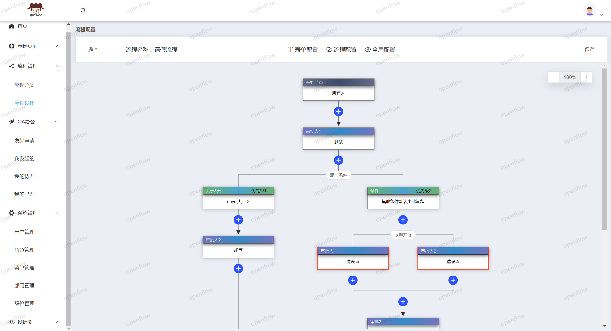
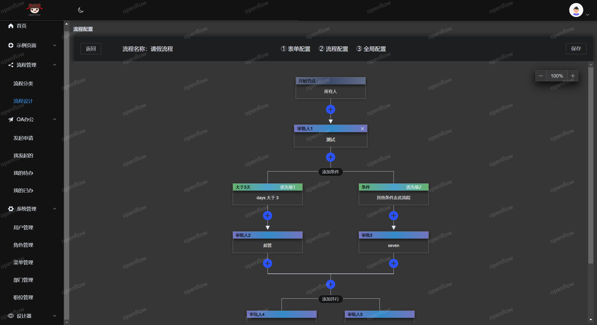

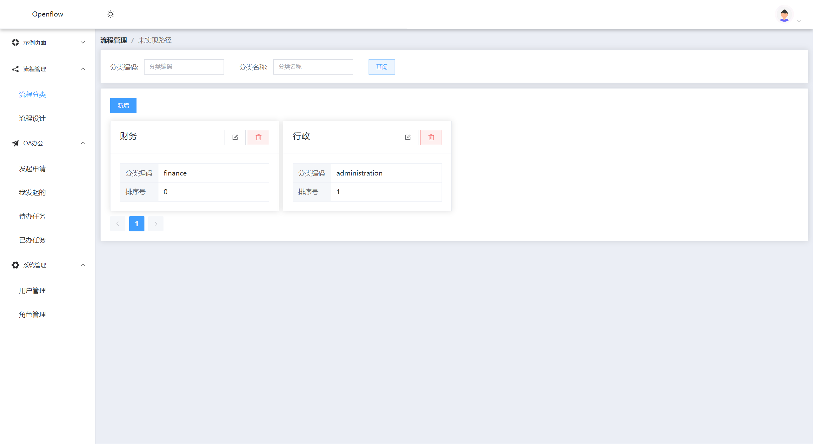
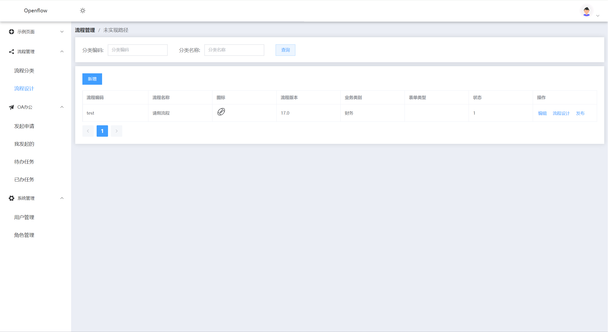
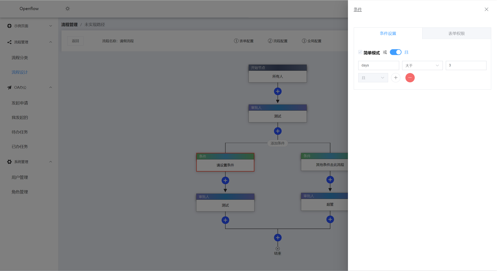
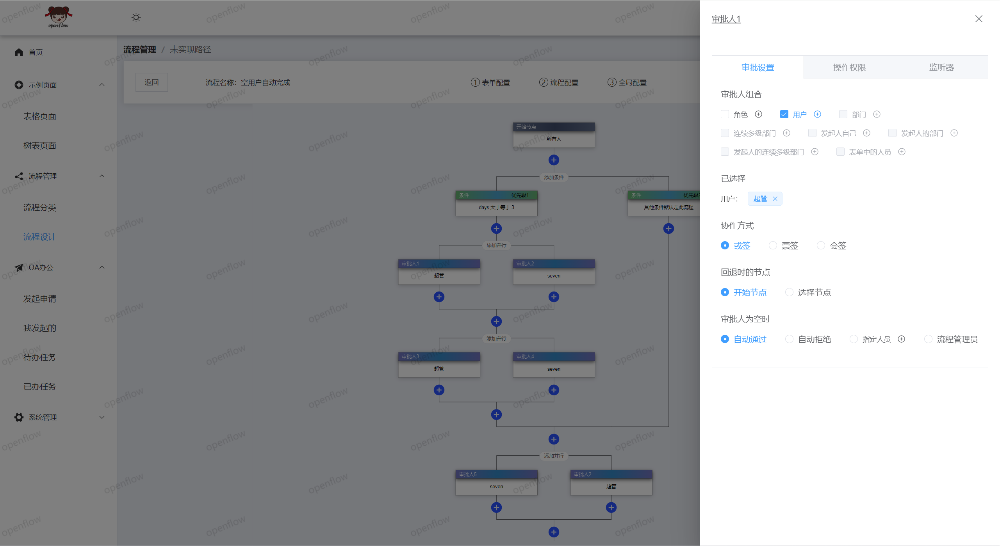
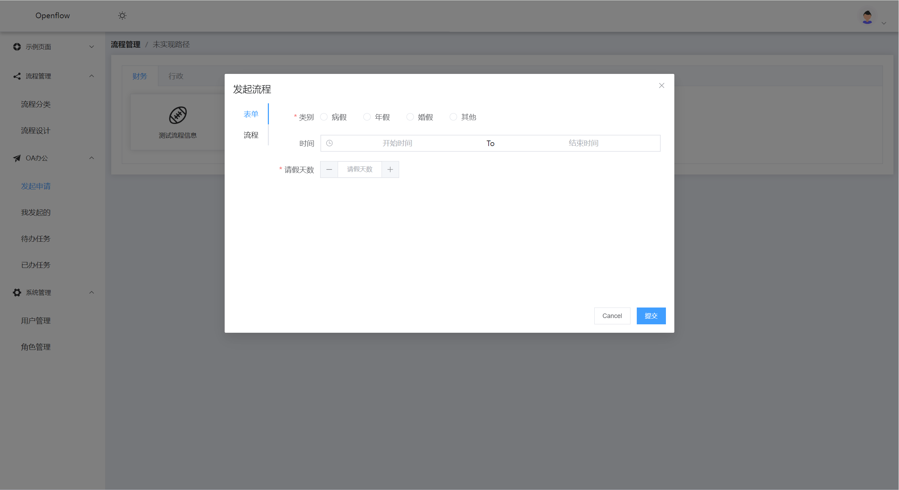

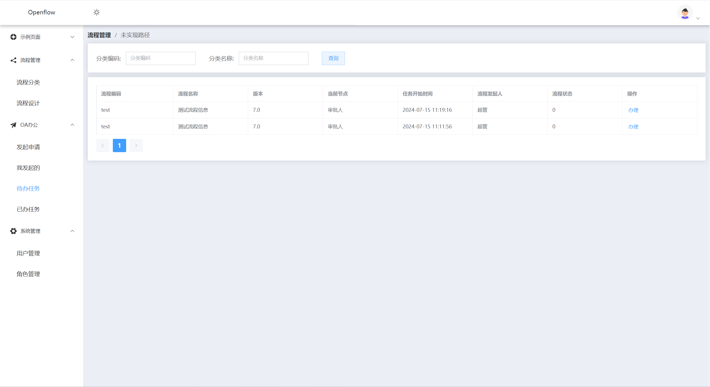
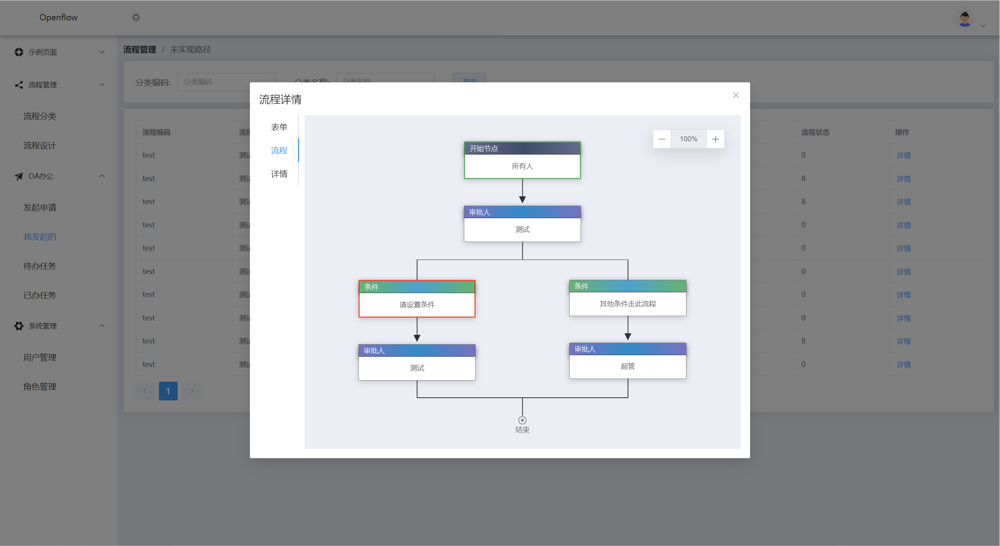
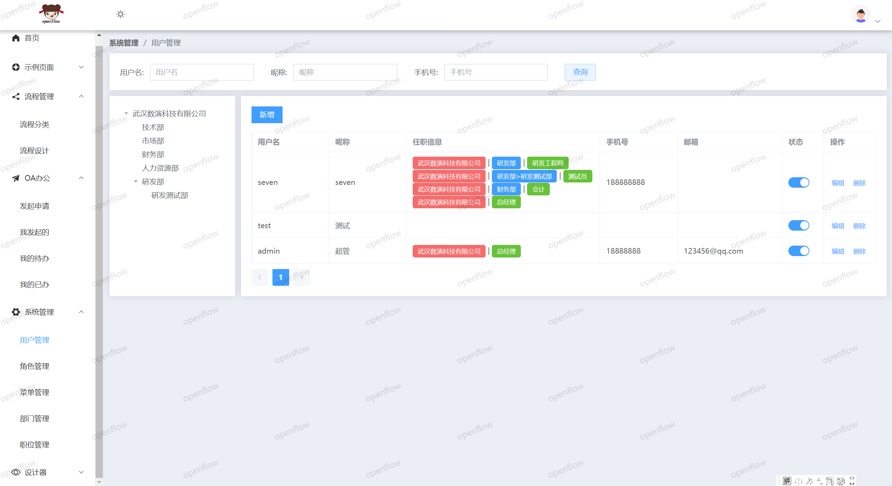
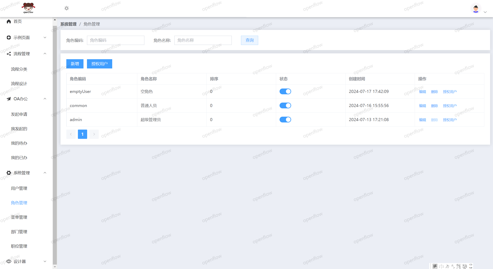
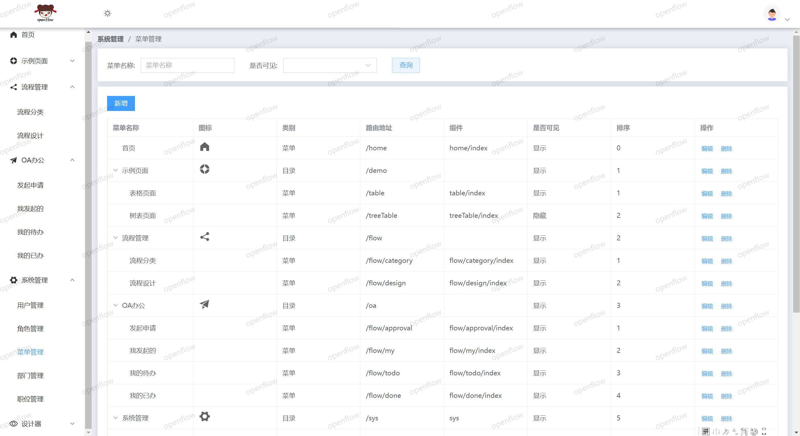
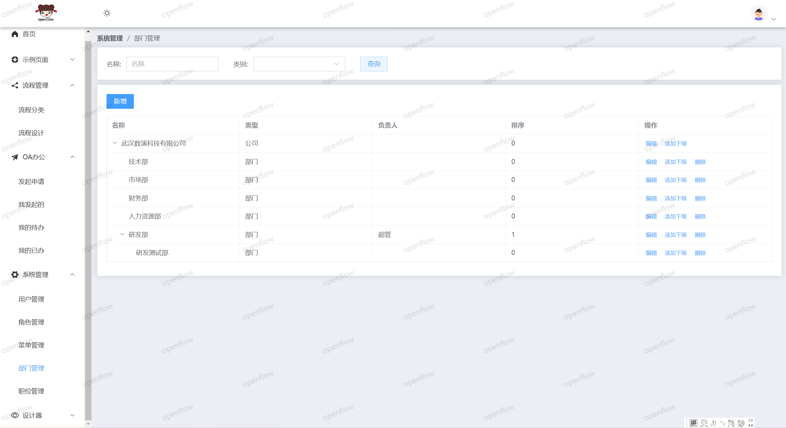
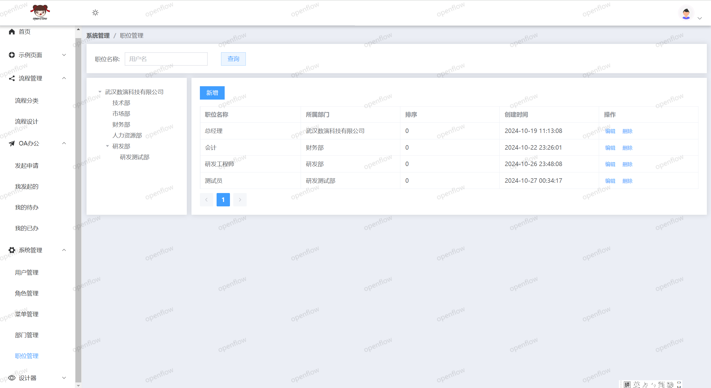

### 后端代码

[https://gitee.com/qq75547276/openflow-admin](https://gitee.com/qq75547276/openflow-admin)

交流群

     仅供学习交流

## 更新记录
### 20240729 晴
 -  好久没记录了
 -  流程图放大又被遮住了~
 -  动态按钮，就参考别人的做法， 还可以
 -  转办，委托， 加签 减签 快了
 -  这个做完，接下来是组织机构还是 优化流程图呢？
### 20240719 晴
 -  条件分支 支持 且 或  or  组合， 计划支持嵌套组合
 -  流程配置 错误提醒
 -  支持 查看我发起的 ，待办， 已办  后续支持
 -  加签  跳转  回退  转办 有序开发中
### 20240715
 -  角色和用户审批权限解析
### 20240714
 -  支持选择用户和角色
### 20240713
 -  谁能提供一张登录页背景图
 -  实现流程自定义表单路径， 表单设计器用什么呢？
 -  实现 用户、权限管理， 等待工作流添加 角色审批功能
 -  实现 简易版登录功能功能
### 20240711
 -  流程设计器页面继续开发
 -  流程 json 转 xml
 -  表单用什么呢 思考。。。
### 20240710
 -  组件设为直角边
 -  封装图标选择器（如何扩展? 文档没看到） 
 -  流程分类
 -  流程定义
 -  流程设计 需要点时间
### 20240707 周日晴
 -  加入 router axios
 -  添加流程分类
 -  数据库主键为Long, 全局转换配置导致其他使用Long类型也转为了string, 这个问题如何解决
### 20240706 周六晴
 -  简化代码
 -  开始工作流功能
 -  准备考虑表单设计框架
### 20240704 周四 晴
 -  增加只读模式
 -  选择节点编辑页面调整
### 20240703 周三 雨
 -  浮窗popover优化
 -  界面按钮优化
 -  各种样式优化...
### 20240702 周二 晴
 -  想来想去，始终需要用到组件， 还是集成了element-plus
 -  支持深色主题
 -  支持节点删除
 -  美化界面
### 20240701 周一 雨
 -  支持缩放
 -  完成基本js交互
 -  待调整结构， 调整类名 文件名... 
### 20240630 周日 晴
 -  代码还需优化
 -  布局自适应。 flex出现滚动问题无法处理 改为grid布局 
 -  浮动按钮优化出现位置，保证不会被遮住
 -  支持缩放 （还没添加按钮）
### 20240628 周五 雨 
 -  流程界面不使用任何第三方ui组件，逐步完善中
 -  后续新增表单配置，会考虑第三方组件
 -  仅供学习交流
 -  后端也会考虑写一套
 -  仅业余时间，更新不会太快
 -  开始时间 202406027 晚上
 